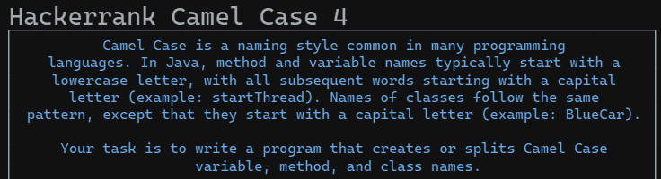
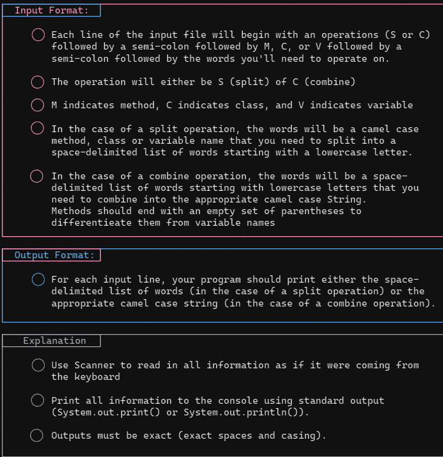
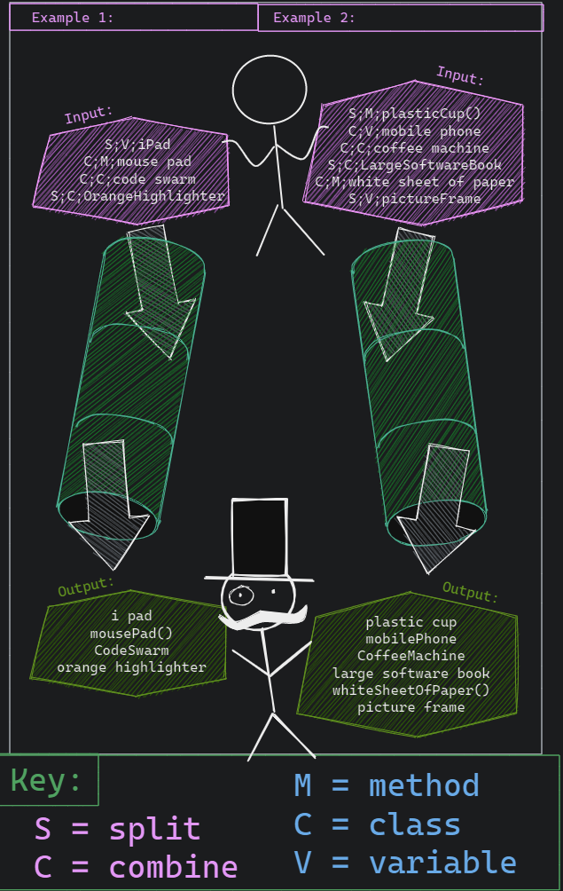
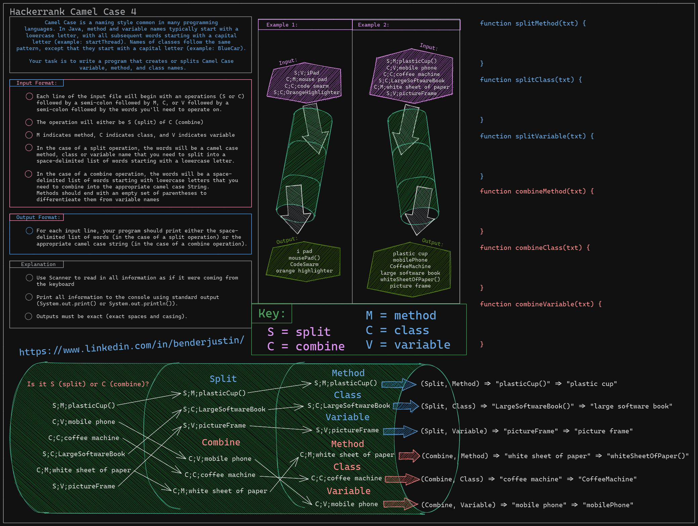
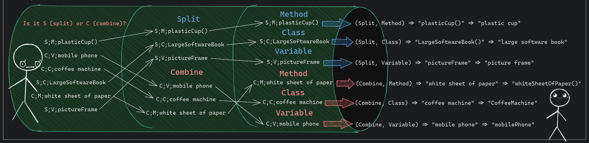
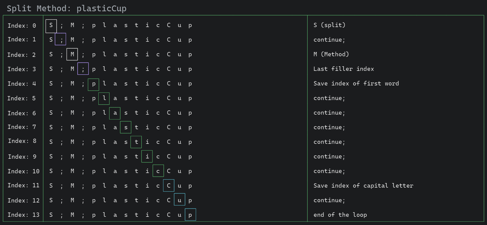
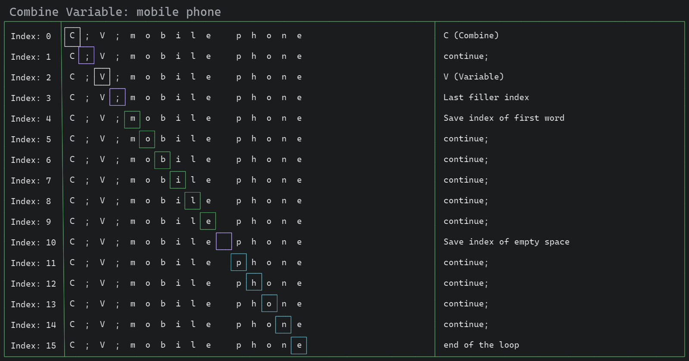
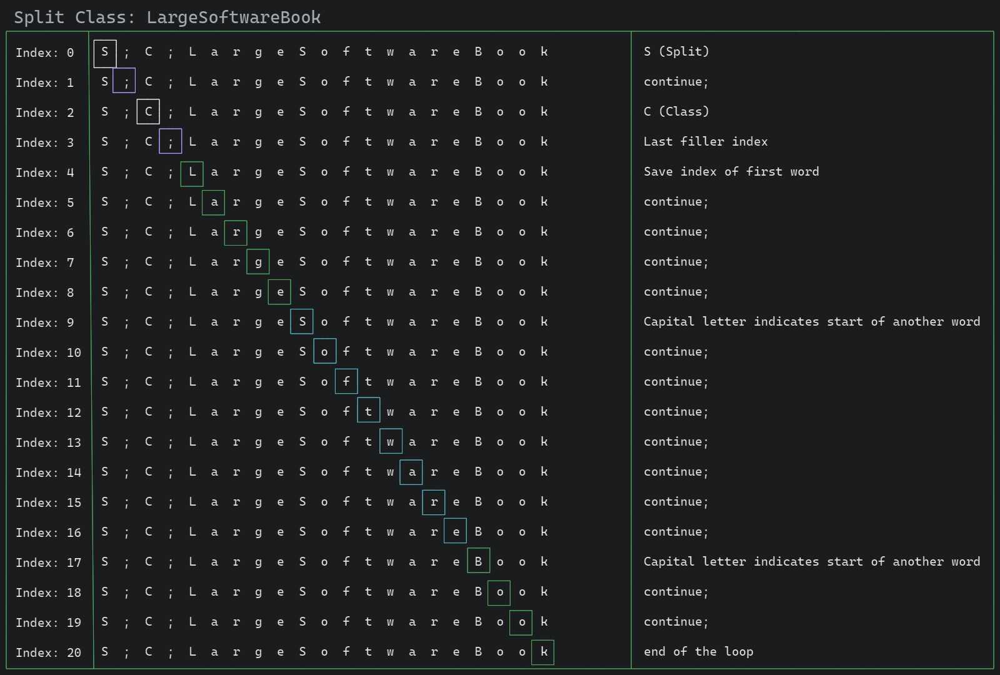
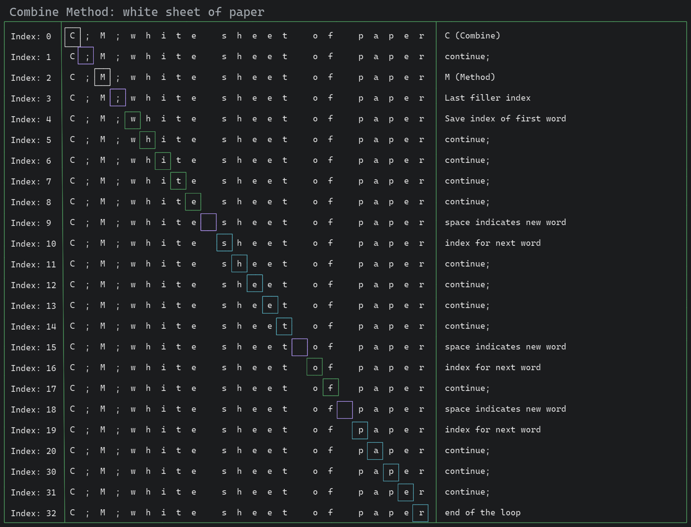
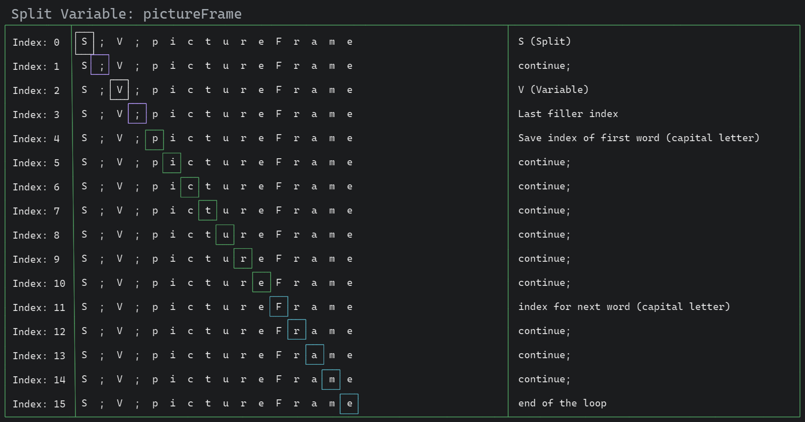

# Camel Case 4

> Justin Bender

## Question



### Input & Output Format



### Examples & Key






I won't retype everything right now. Maybe I'll come back to it. I'm
focused on excalidraw. I will attach the images to the page.

## What is the solution?

We want to do something involving a sliding window. It's a bit expensive
to break apart a string into more strings. What we want to do is peek
inside of the array of letters. Then we keep track of the index at those
points. So when we perform the splits/copy. We know which index to
perform at.

We will break down each loop to be able to create separate utility
functions around each `key`.

### Keys

#### Combine or Split

* `S`: split
* `C`: combine

#### Method, Class or Variable

* `M`: method
* `C`: Class
* `V`: Variable




If you notice there around around 6 different variations possible. All
of them included inside of this pipeline example.

This example is:

* `S;M;plasticCup()`

* `C;V;mobile phone`

* `C;C;coffee machine`

* `S;C;LargeSoftwareBook`

* `C;M;white sheet of paper`

* `S;V;pictureFrame`

We should dive a bit deeper into each of them.

I would first like to bring up the loop that we plan to be using:

```javascript
function processData(input) {
  const lines = input.trim().split('\n');
  for (let i = 0; i < lines.length; i++) {
    console.log(lines[i]);
    console.log(i);
  }
}
```

This is because the data comes in in a chunk.

```
S;V;iPad
C;M;mouse pad
C;C;code swarm
S;C;OrangeHighlighter
Your Output (stdout)
S;V;iPad
0
C;M;mouse pad
1
C;C;code swarm
2
S;C;OrangeHighlighter
3
```

But why would be split the chunk? That's too much work. Can't we just
analyse the string and output values. Almost like we are using a window
into the string.

We could almost imagine that the input is:

```
S;M;plasticCup()\nC;V;mobile phone\nC;C;coffee machine\nS;C;LargeSoftwareBook\nC;M;white sheet of paper\nS;V;pictureFrame\n
```

Which makes a bit more sense when we look at it. Then we will be moving
over 1 window block at a time

### `S;M;plasticCup()`

1) [S]: Split words

```
[S];M;plasticCup()\nC;V;mobile phone\nC;C;coffee machine\nS;C;LargeSoftwareBook\nC;M;white sheet of paper\nS;V;pictureFrame\n
```

2) [;]: filler

```
S[;]M;plasticCup()\nC;V;mobile phone\nC;C;coffee machine\nS;C;LargeSoftwareBook\nC;M;white sheet of paper\nS;V;pictureFrame\n
```

3) [M]: The word is a method

```
S[;]M;plasticCup()\nC;V;mobile phone\nC;C;coffee machine\nS;C;LargeSoftwareBook\nC;M;white sheet of paper\nS;V;pictureFrame\n
```



### `C;V;mobile phone`



### `C;C;coffee machine`


### `S;C;LargeSoftwareBook`



### `C;M;white sheet of paper`



### `S;V;pictureFrame`




