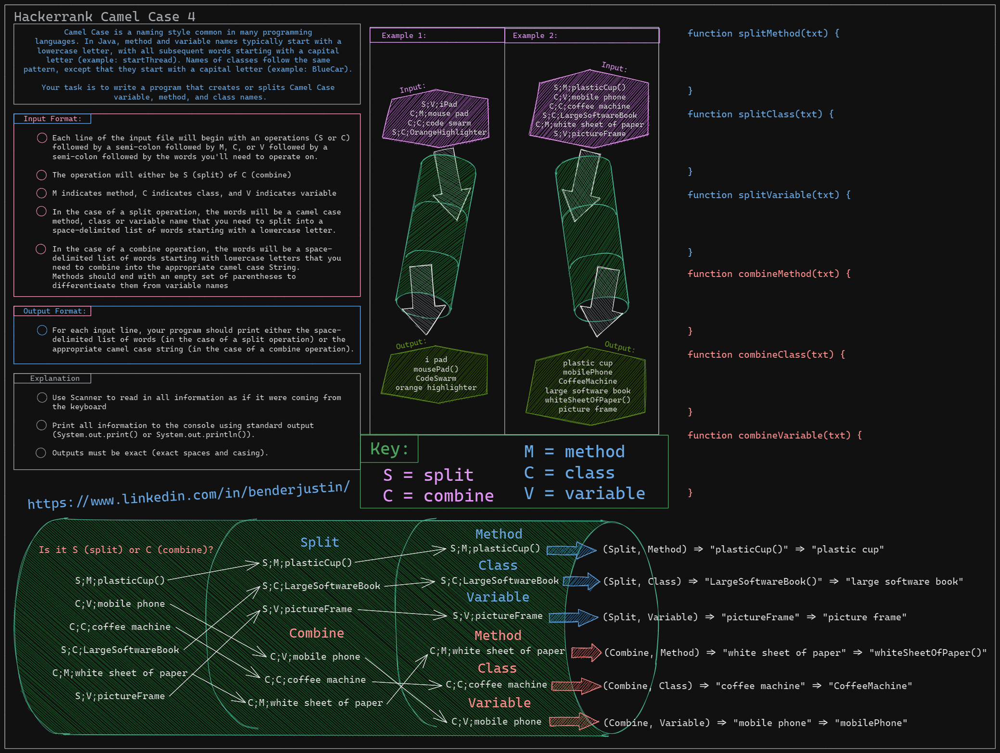
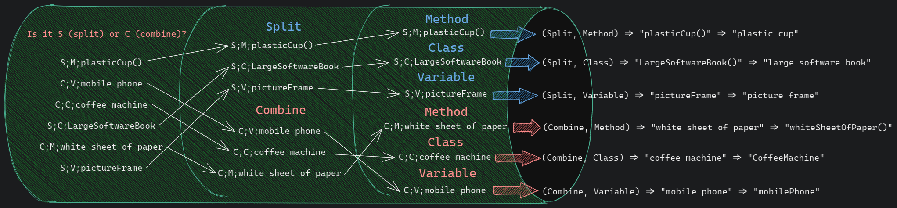
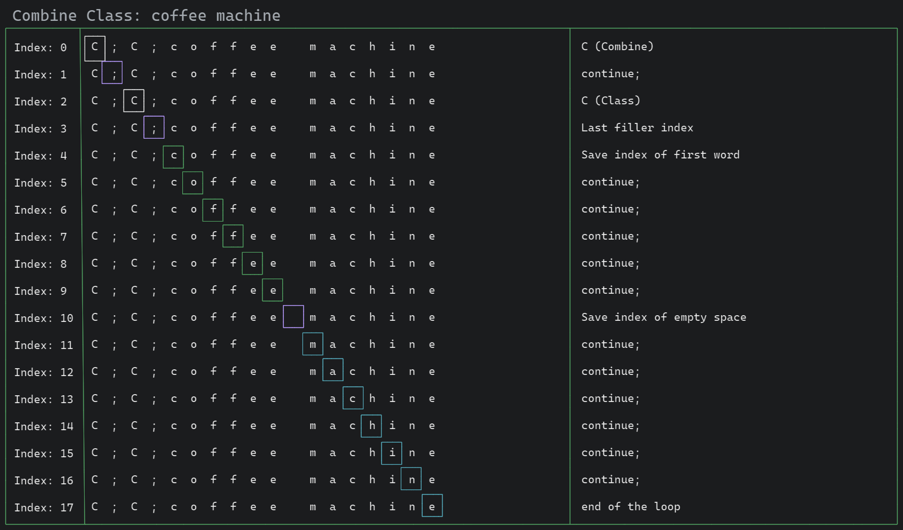
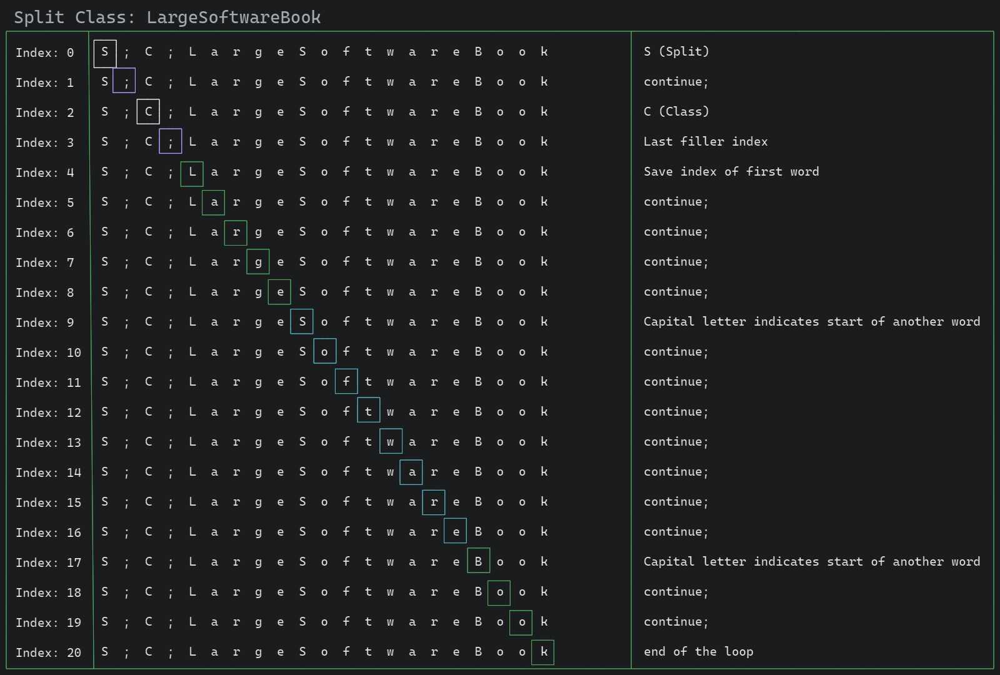
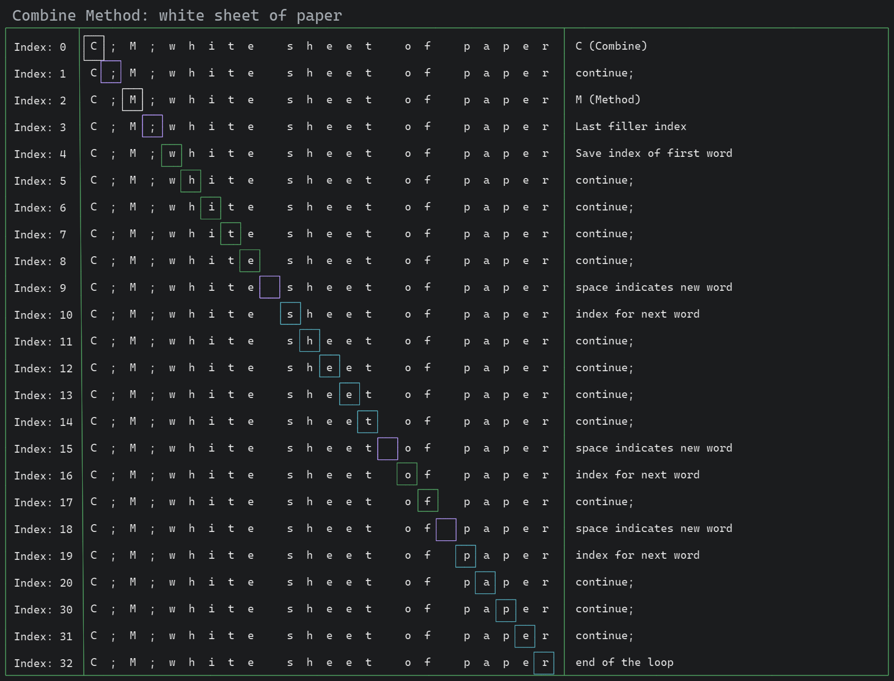
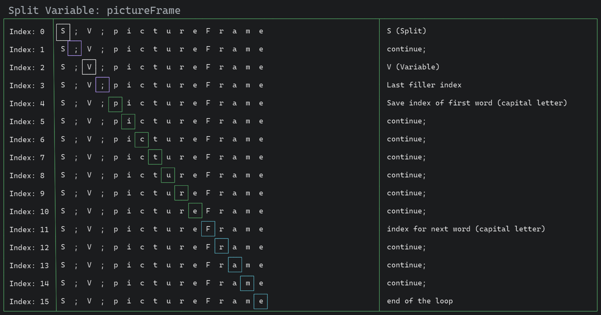

# Camel Case 4

> Justin Bender

I won't retype everything right now. Maybe I'll come back to it. I'm
focused on excalidraw. I will attach the images to the page.

## What is the solution?

We want to do something involving a sliding window. It's a bit expensive
to break apart a string into more strings. What we want to do is peek
inside of the array of letters. Then we keep track of the index at those
points. So when we perform the splits/copy. We know which index to
perform at.

We will break down each loop to be able to create separate utility
functions around each `key`.

### Keys

* `S`: split
* `C`: combine

* `M`: method
* `C`: Class
* `V`: Variable

If you notice there around around 6 different variations possible. All
of them included inside of this pipeline example.

This example is:

* `S;M;plasticCup()`

* `C;V;mobile phone`

* `C;C;coffee machine`

* `S;C;LargeSoftwareBook`

* `C;M;white sheet of paper`

* `S;V;pictureFrame`

We should dive a bit deeper into each of them.

### `S;M;plasticCup()`

### `C;V;mobile phone`

### `C;C;coffee machine`

### `S;C;LargeSoftwareBook`

### `C;M;white sheet of paper`

### `S;V;pictureFrame`

