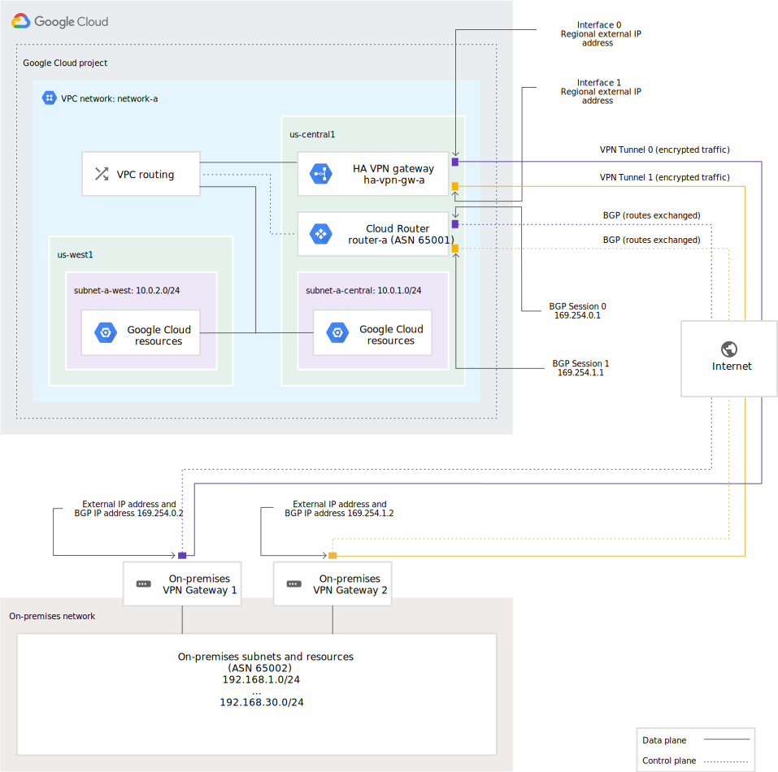

# HA VPN topologies

With Cloud VPN, your on-premises hosts communicate through one or more
IPsec VPN tunnels to Compute Engine virtual machine (VM) instances in
your project's Virtual Private Cloud (VPC) networks.

This page describes recommended topologies for HA VPN. For Classic VPN
topologies, see [Classic VPN topologies](https://cloud.google.com/network-connectivity/docs/vpn/concepts/classic-topologies). For more information about Cloud
VPN, including both VPN types, see the [Cloud VPN overview](https://cloud.google.com/network-connectivity/docs/vpn/concepts/overview).

For definitions of terms used on this page, see [Key terms](https://cloud.google.com/network-connectivity/docs/vpn/concepts/key-terms)

## Overview

HA VPN supports site-to-site VPN in one of the following recommended
topologies or configuration scenarios. To determine the appropriate
configuration scenarios to use, check with the vendor of your peer VPN
gateway:

* **An HA VPN gateway to peer VPN devices**. The following topologies
  require two VPN tunnels from the perspective of the HA VPN gateway. To
  determine which topology is most appropriate, check with the vendor of
  your peer VPN gateway.
    * An HA VPN gateway to two separate peer VPN devices where each peer
      device has its own external IP address.
    * An HA VPN gateway to one peer VPN device that has two separate
      external IP addresses.
    * An HA VPN gateway to one peer VPN device that has one external IP
      address.
* **An HA VPN gateway to an Amazon Web Services (AWS) virtual private
  gateway**, which is a peer gateway configuration with four interfaces.
* **Two HA VPN gateways connected to each other**.

> #### Note:
> All peer gateway scenarios are represented in Google Cloud by a single
external Peer VPN resource.

### Configurations that support 99.99% availability

To guarantee a 99.99% availability SLA for HA VPN connection, properly
configure two of four tunnels from your HA VPN gateway to your peer VPN
gateway or to another HA VPN gateway.

Proper configuration means that VPN tunnels must supply adequate
redundancy by connecting to all interfaces of the HA VPN gateway and to
all interfaces of the peer VPN gateway or other HA VPN gateway.

> #### Note:
> Receiving an end-to-end 99.99% availability SLA also depends on proper
configuration of the peer VPN gateway.

Each of the following sections covers how to configure tunnels on both
ends of the VPN connection to guarantee 99.99% availability.

### Configure HA VPN for more bandwidth

To increase the bandwidth of your HA VPN gateways, add more HA VPN
tunnels.

To calculate how many tunnels you will need, use 3 Gbps as the sum of
ingress and egress bandwidth available for each tunnel. For example, if
you require 12 Gbps for ingress plus egress, you should use four tunnels
simultaneously (12 / 3 = 4) For more information about VPN bandwidth
calculations, see [Network banwidth](https://cloud.google.com/network-connectivity/docs/vpn/concepts/overview#network-bandwidth).

Consider the following guidelines when increasing HA VPN bandwidth.

* **Check VPN tunnel quotas**

  Unless you are connecting an HA VPN gateway to another HA VPN gateway,
  each HA VPN gateway supports an unlimited number of VPN tunnels on
  each interface.

  However, the VPN tunnels quota limits the total number of VPN tunnels
  in your project.

* **Add HA VPN gateways to add tunnels between two HA VPNs**

  When you connect an HA VPN gateway to another HA VPN gateway, you can
  only connect one tunnel per interface, 0, or 1, to the corresponding
  interface, 0 or 1, on the other HA VPN gateway. In other words,
  between a pair of HA VPN gateways, you have a maximum of two HA VPN
  tunnels.

  Therefore, to increase the number of VPN tunnels between HA VPN
  gateways, you much create additional pairs of HA gateways.

* **Add pairs of VPN tunnels**

  To increase the bandwidth between HA VPN and an on-premises peer VPN
  gateway, add VPN tunnel pairs

  For example, to double the bandwidth of an HA VPN gateway that connets
  to an on-premise peer VPN gateway with two tunnels (one active, one
  passive), add two more VPN tunnels. Add one more "active" tunnel and
  one more "passive" tunnel.

  The BGP sessions for all four tunnels receive the same prefixes. The
  two active tunnels receive the prefixes with the same higher priority,
  and the two passive tunnels receive the prefixes with the same lower
  priority.

* **Match interfaces on the peer VPN gateway**

  You must match the interfaces on your peer VPN gateway to continue
  receiving a 99.99% uptime SLA.

  When doubling the bandwidth of an HA VPN gateway that connects to an
  on-premises VPN gateway, match the tunnels to the interfaces on the
  peer VPN gateway. Place the two active tunnels on interface 0 and the
  two passive tunnels on interface 1. Alternatively, place the two
  active tunnels on interface 1 and the two passive tunnels on interface
  0.

##### Increase bandwidth example

The following is a list of the Google Cloud resources used by a HA VPN
connection to an on-premises peer VPN gateway with 12 Gbps throughput:

  * One Cloud Router
  * One HA VPN gateway with eight total VPN tunnels, including
    * Four active tunnels connect to interface 0
    * Four passive tunnels connected to interface 1
  * Eight total BGP sessions, with each BGP session corresponding to an
    HA VPN tunnel

### HA VPN to peer VPN gateways

There are three typical peer gateways configurations for HA VPN:

  * An HA VPN gateway to two separate peer VPN devices, each with its
    own IP address.
  * An HA VPN gateway to one peer VPN device that uses two separate IP
    addresses.
  * An HA VPN gateway to one peer VPN device that uses one IP address

To set up any of these configurations, see [Create an HA VPN to a peer
VPN gateway](https://cloud.google.com/network-connectivity/docs/vpn/how-to/creating-ha-vpn)

If you deploy an HA VPN gateway with an IPv4 and IPv6 dual-stack type,
then your VPN tunnels can support the exchange of IPv6 traffic. IPv6
must also be enabled in the BGP sessions that you create for the VPN
tunnels. In this scenario, you can assign IPv6 addresses to the
on-premise subnets and VPC subnets in the following topologies.

#### Two peer VPN devices

If your peer-side gateway is hardware-based, having a second peer-side
gateway provides redundancy and failover on that side of the connection.
A second physical gateway lets you take one of the gateways offline for
software upgrades or other scheduled maintenance. It also protects you
if there is a failure in one of the devices.

In this topology, one HA VON gateway connects to two peer devices. Each
peer device has one interface and one external IP address. The HA VPN
gateway uses two tunnels, one tunnel to each peer device.

In Google Cloud, the `REDUNDANCY_TYPE` for this configuration takes the
value `TWO_IPS_REDUNDANCY`.

The following example provides 99.99% availability.

