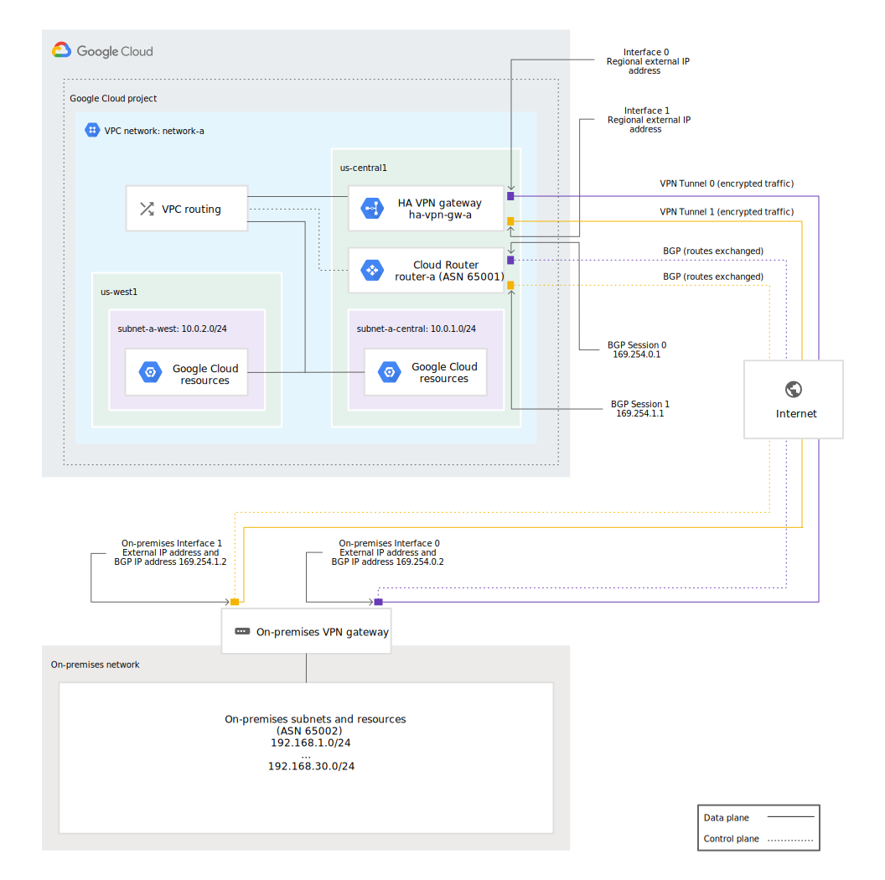
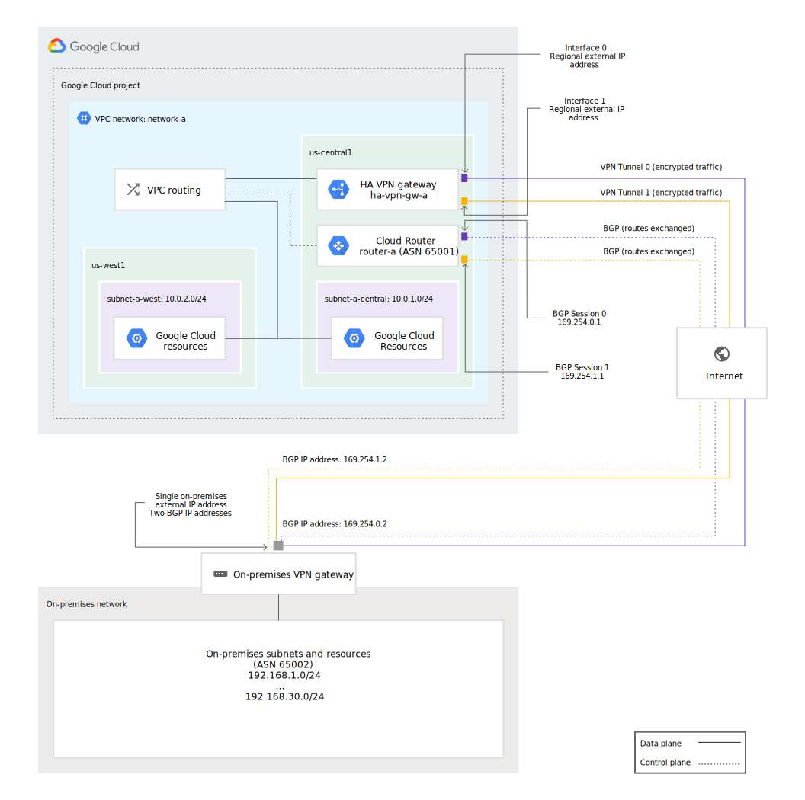
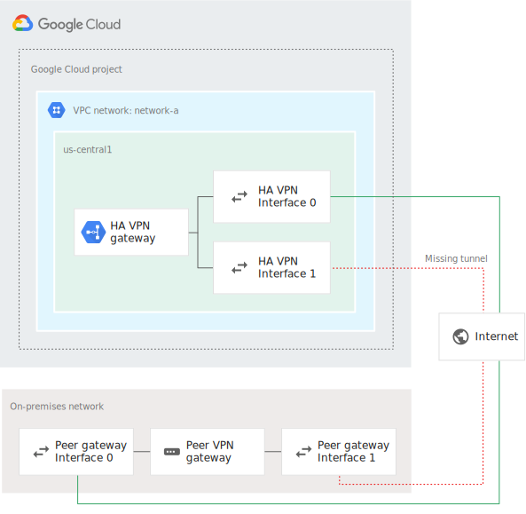
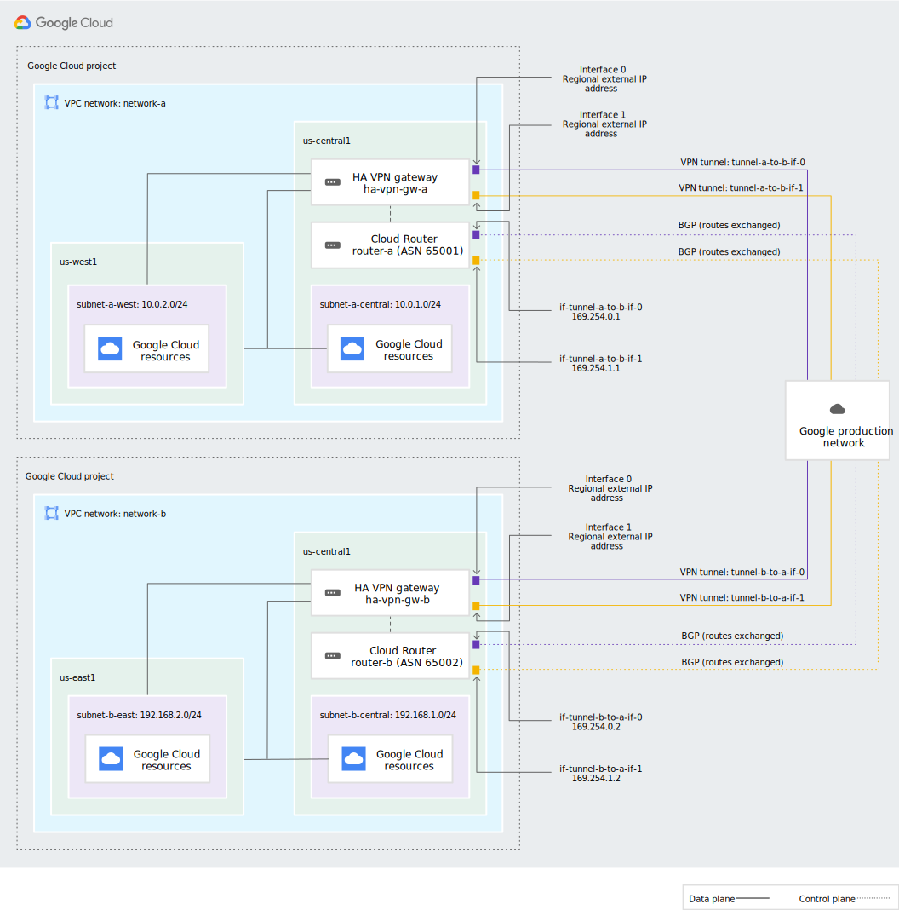

# HA VPN topologies

With Cloud VPN, your on-premises hosts communicate through one or more
IPsec VPN tunnels to Compute Engine virtual machine (VM) instances in
your project's Virtual Private Cloud (VPC) networks.

This page describes recommended topologies for HA VPN. For Classic VPN
topologies, see [Classic VPN topologies](https://cloud.google.com/network-connectivity/docs/vpn/concepts/classic-topologies). For more information about Cloud
VPN, including both VPN types, see the [Cloud VPN overview](https://cloud.google.com/network-connectivity/docs/vpn/concepts/overview).

For definitions of terms used on this page, see [Key terms](https://cloud.google.com/network-connectivity/docs/vpn/concepts/key-terms)

## Overview

HA VPN supports site-to-site VPN in one of the following recommended
topologies or configuration scenarios. To determine the appropriate
configuration scenarios to use, check with the vendor of your peer VPN
gateway:

* **An HA VPN gateway to peer VPN devices**. The following topologies
  require two VPN tunnels from the perspective of the HA VPN gateway. To
  determine which topology is most appropriate, check with the vendor of
  your peer VPN gateway.
    * An HA VPN gateway to two separate peer VPN devices where each peer
      device has its own external IP address.
    * An HA VPN gateway to one peer VPN device that has two separate
      external IP addresses.
    * An HA VPN gateway to one peer VPN device that has one external IP
      address.
* **An HA VPN gateway to an Amazon Web Services (AWS) virtual private
  gateway**, which is a peer gateway configuration with four interfaces.
* **Two HA VPN gateways connected to each other**.

> #### Note:
> All peer gateway scenarios are represented in Google Cloud by a single
external Peer VPN resource.

### Configurations that support 99.99% availability

To guarantee a 99.99% availability SLA for HA VPN connection, properly
configure two of four tunnels from your HA VPN gateway to your peer VPN
gateway or to another HA VPN gateway.

Proper configuration means that VPN tunnels must supply adequate
redundancy by connecting to all interfaces of the HA VPN gateway and to
all interfaces of the peer VPN gateway or other HA VPN gateway.

> #### Note:
> Receiving an end-to-end 99.99% availability SLA also depends on proper
configuration of the peer VPN gateway.

Each of the following sections covers how to configure tunnels on both
ends of the VPN connection to guarantee 99.99% availability.

### Configure HA VPN for more bandwidth

To increase the bandwidth of your HA VPN gateways, add more HA VPN
tunnels.

To calculate how many tunnels you will need, use 3 Gbps as the sum of
ingress and egress bandwidth available for each tunnel. For example, if
you require 12 Gbps for ingress plus egress, you should use four tunnels
simultaneously (12 / 3 = 4) For more information about VPN bandwidth
calculations, see [Network banwidth](https://cloud.google.com/network-connectivity/docs/vpn/concepts/overview#network-bandwidth).

Consider the following guidelines when increasing HA VPN bandwidth.

* **Check VPN tunnel quotas**

  Unless you are connecting an HA VPN gateway to another HA VPN gateway,
  each HA VPN gateway supports an unlimited number of VPN tunnels on
  each interface.

  However, the VPN tunnels quota limits the total number of VPN tunnels
  in your project.

* **Add HA VPN gateways to add tunnels between two HA VPNs**

  When you connect an HA VPN gateway to another HA VPN gateway, you can
  only connect one tunnel per interface, 0, or 1, to the corresponding
  interface, 0 or 1, on the other HA VPN gateway. In other words,
  between a pair of HA VPN gateways, you have a maximum of two HA VPN
  tunnels.

  Therefore, to increase the number of VPN tunnels between HA VPN
  gateways, you much create additional pairs of HA gateways.

* **Add pairs of VPN tunnels**

  To increase the bandwidth between HA VPN and an on-premises peer VPN
  gateway, add VPN tunnel pairs

  For example, to double the bandwidth of an HA VPN gateway that connets
  to an on-premise peer VPN gateway with two tunnels (one active, one
  passive), add two more VPN tunnels. Add one more "active" tunnel and
  one more "passive" tunnel.

  The BGP sessions for all four tunnels receive the same prefixes. The
  two active tunnels receive the prefixes with the same higher priority,
  and the two passive tunnels receive the prefixes with the same lower
  priority.

* **Match interfaces on the peer VPN gateway**

  You must match the interfaces on your peer VPN gateway to continue
  receiving a 99.99% uptime SLA.

  When doubling the bandwidth of an HA VPN gateway that connects to an
  on-premises VPN gateway, match the tunnels to the interfaces on the
  peer VPN gateway. Place the two active tunnels on interface 0 and the
  two passive tunnels on interface 1. Alternatively, place the two
  active tunnels on interface 1 and the two passive tunnels on interface
  0.

##### Increase bandwidth example

The following is a list of the Google Cloud resources used by a HA VPN
connection to an on-premises peer VPN gateway with 12 Gbps throughput:

  * One Cloud Router
  * One HA VPN gateway with eight total VPN tunnels, including
    * Four active tunnels connect to interface 0
    * Four passive tunnels connected to interface 1
  * Eight total BGP sessions, with each BGP session corresponding to an
    HA VPN tunnel

### HA VPN to peer VPN gateways

There are three typical peer gateways configurations for HA VPN:

  * An HA VPN gateway to two separate peer VPN devices, each with its
    own IP address.
  * An HA VPN gateway to one peer VPN device that uses two separate IP
    addresses.
  * An HA VPN gateway to one peer VPN device that uses one IP address

To set up any of these configurations, see [Create an HA VPN to a peer
VPN gateway](https://cloud.google.com/network-connectivity/docs/vpn/how-to/creating-ha-vpn)

If you deploy an HA VPN gateway with an IPv4 and IPv6 dual-stack type,
then your VPN tunnels can support the exchange of IPv6 traffic. IPv6
must also be enabled in the BGP sessions that you create for the VPN
tunnels. In this scenario, you can assign IPv6 addresses to the
on-premise subnets and VPC subnets in the following topologies.

#### Two peer VPN devices

If your peer-side gateway is hardware-based, having a second peer-side
gateway provides redundancy and failover on that side of the connection.
A second physical gateway lets you take one of the gateways offline for
software upgrades or other scheduled maintenance. It also protects you
if there is a failure in one of the devices.

In this topology, one HA VPN gateway connects to two peer devices. Each
peer device has one interface and one external IP address. The HA VPN
gateway uses two tunnels, one tunnel to each peer device.

In Google Cloud, the `REDUNDANCY_TYPE` for this configuration takes the
value `TWO_IPS_REDUNDANCY`.

The following example provides 99.99% availability.

#### One peer VPN device with two IP addresses

This topology describes one HA VPN gateway that connects to one peer
device that has two separate external IP addresses. The HA VPN gateway
uses two tunnels, one tunnel to each external IP address on the peer
device.

In Google Cloud, the `REDUNDANCY_TYPE` for this configuration takes the
value `TWO_IPS_REDUNCANCY`.

The following example provides 99.99% availability.

#### One peer VON device with one IP address

This topology describes on HA VPN gateway that connects to one peer
device that has one external IP address. The HA VPN gateway uses two
tunnels, both tunnels to the single external IP address on the peer
device.

In Google Cloud, the `REDUNCANCY_TYPE` for this configuration takes the
value `SINGLE_IP_INTERNALLY_REDUNDANT`.

The following example provides 99.99% availability

#### Guarantee 99.99% availability

To meet the 99.99% SLA on the Google Cloud side, there must be a tunnel
from each of the two interfaces on the HA VPN gateway to the
corresponding interfaces on the peer gateway.

If the peer gateway has two interfaces, then configuring two tunnels,
one from each peer interface to each HA VPN gateway interface, meets the
requirements for the 99.99% SLA. A full mesh configuration is not
required for 99.99% SLA on the Google Cloud side. In this case, a full
mesh is defined as two tunnels from each HA VPN interface to each of the
two interfaces on the peer gateway, for a total of four tunnels from the
Google Cloud side. To confirm if your VPN vendor recommends a full mesh
configuration, see the documentation for your peer (on-premises) VPN
device or contact your VPN vender.

In configurations with two peers interfaces, tunnels on each of the
following interfaces on the HA VPN gateway match the corresponding
interfaces on the peer gateway or gateways:

* HA VPN `interface 0` to peer `interface 0`
* HA VPN `interface 1` to peer `interfece 1`

Examples are shown in the diagrams for two peer devices, two interfaces
and one peer device, two interfaces.

If there is only one peer interface on one peer gateway, each tunnel
from each HA gateway interface must connect to the single peer
interface. See the diagram for one peer device, one interface.

> ##### Caution
>
> To receive the 99.99% availability SLA, configure at least one tunnel
on each HA VPN gateway interface. Configuring only one tunnel from a
single HA VPN interface to a single interface on the peer gateway
doesn't provide enough redundancy to meet the SLA because there is an
unused interface on the HA VPN gateway, which does not have a tunnel
configured on it.

The following example does not provide 99.99% availability:

* HA VPN `interface 0` to peer `interface 0`

### HA VPN to AWS peer gateways

When configuring an HA VPN external gateway to Amazon Web Services
(AWS), you can use either a transit gateway or a virtual private
gateway. Only the transit gateway supports equal-cost multipath (ECMP)
routing. When enabled, ECMP equally distributes traffic across active
tunnels. The supported topology requires two AWS Site-to-Site VPN
connection, `A` and `B`, each with two external IP addresses. This
topology yields four external IP addresses in AWS: `A1`, `A2`, `B1` and
`B2`.

> ##### Known issue:
>
> When configuring VPN tunnels to AWS, use the IKEv2 encryption protocol
and select fewer transform sets on the AWS side; otherwise, the cloud
VPN tunnel can fail to re-key. For example, select a combination of
single Phase 1 and Phase 2 encryption algorithms, integrity algorithms,
and DH group numbers.
>
> This re-keying issue is caused by a large SA payload size for the
default set of AWS transform sets. This large payload size results in IP
fragmentation of IKE packets on the AWS side, which Cloud VPN does not
support.

1. Configure the four AWS IP addresses as a single external HA VPN
   gateway with `FOUR_IPS_REDUNDANCY`, where:

   * AWS IP `0`=`A1`
   * AWS IP `1`=`A2`
   * AWS IP `2`=`B1`
   * AWS IP `3`=`B2`

2. Create four tunnels on the HA VPN gateway to meet the 99.99% SLA by
   using the following configuration:

   * HA VPN `interface 0` to AWS `interface 0`
   * HA VPN `interface 0` to AWS `interface 0`
   * HA VPN `interface 1` to AWS `interface 1`
   * HA VPN `interface 1` to AWS `interface 1`

Set up HA VPN with AWS:

1. In Google Cloud, create an HA VPN gateway and a Cloud Router in a
   region that you want. This action creates two external IP addresses,
   on for each gateway interface. Record the external IP addresses for
   use in the next step.

2. In AWS, create two customers gateways by using the following:

  * The **Dynamic** routing option
  * The Google ASN of the Cloud Rounter
  * The external IP addresses of the Google Cloud HA VPN gateway `interface 0` and `1`

3. Complete the steps that correspond to the AWS VPN option that you are
   using:

   * **Transit Gateway**
     * create a transit gateway VPN attachment for the first customer
        gateway (`interface 0`), and use the **Dynamic** routing option.
     * Repeat the previous step for the second customer gateway (`interface 1`).

  * **Virtual Private Gateway**
    * Create a Site-to-Site VPN connection for the first customer
      gateway (`interface 0`) by using the following:
        * A **Target Gateway Type** or **Virtual Private Gateway**
        * The **Dynamic** routing option
    * Repeat the previous step for the second customer gateway (`interface 1`).

4. Download the AWS configuration files for both connections that you
   created. The files contain information that you need during the next
   steps in this procedure, including pre-shared authentication keys,
   outside tunnel IP addresses, and inside tunnel IP addresses.

5. In Google Cloud, do the following:

  * Create a new peer VPN gateway with four interfaces by using the AWS
    external IP addresses form the files that you downloaded in the
    previous step.
  * Create four VPN tunnels on the HA VPN gateway that you created in
    step 1. For each tunnel, configure the HA VPN gateway interface with
    the appropriate peer VPN gateway interface and pre-shared keys by
    using the information in the AWS configuration files that you
    downloaded.
  * Configure BGP sessions on the Cloud Router by using the BGP IP
    addresses from the downloaded AWS configuration files

### HA VPN between Google Cloud networks

You can connect two Google Cloud VPC networks together by using an HA
VPN gateway in each network. Both HA VPN gateways must be in the same
region.

If you deploy two HA VPN gateways with the IPv4 and IPv6 dual-stack
type, then your VPN tunnels can support the exchange of IPv6 traffic.
IPv6 must also be enabled in the BGP sessions that you create for the
VPN tunnels. In this scenario, you can assign IPv6 addresses to the VPC
subnets in the following topology.

The following example provides 99.99% availability.

From the perspective of each HA VPN gateway, you create two tunnels so
that both of the following are true:

* `interface 0` on one HA VPN gateway to `interface 0` on the other HA
  VPN
* `interface 1` on one HA VPN gateway to `interface 1` on the other HA
  VPN

To set up this configuration, see [Create two fully configured HA VPN
gateways that connect to each other](https://cloud.google.com/network-connectivity/docs/vpn/how-to/creating-ha-vpn2#creating-ha-gw-2-gw-and-tunnel).

> ##### Note:
>
> Transitive routing over an HA VPN gateway to a statically routed
network is not supported. For example, in the preceding diagram, if VPC
network **network-b** has a static route to an external network, then
VPC network **network-a** isn't able to route traffic to that network.

#### Guarantee 99.99% availability

> ##### Caution:
>
> Configuring only one tunnel on one interface for each HA VPN gateway
does not provide a 99.99% SLA.

To provide 99.99% availability for HA VPN to HA VPN gateways, the
following interfaces on both gateways must match:

* HA VPN `interface 0` to HA VPN `interface 0` and
* HA VPN `interface 1` to HA VPN `interface 1`

