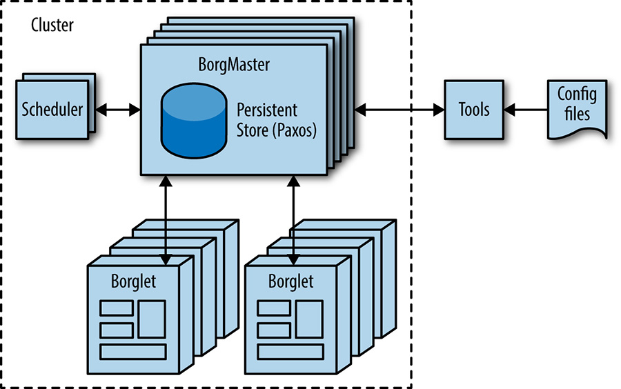
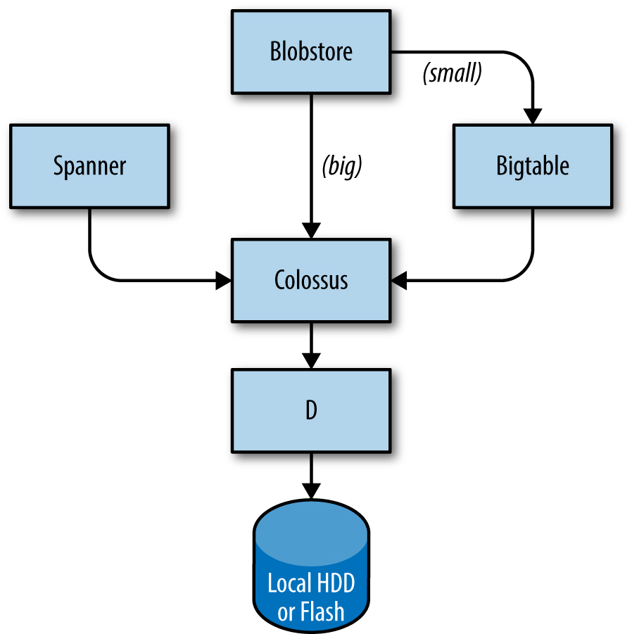

# The Production Environment at Google, from the Viewpoint of an SRE

> Written by JC van Winkel
> Edited by Betsy Beyer

Google data centers are very different from most conventional data centers
and small-scale server farms. These differences present both extra
problems and opportunities. This chapter discusses the challenges and
opportunities that characterize Google data centers and introduce
terminology that is used throughout the book.

## Hardware

Most of Google's compute resources are in Google-designed data centers
with proprietary power distribution, cooling, networking, and compute
hardware (see
[[Bar13]](https://sre.google/sre-book/bibliography#Bar13)). Unlike
"standard" co-location data centers, the compute hardware in a
Google-designed data center is the same across the board. To eliminate
the confusion between server hardware and server software, we use the
following terminology throughout the book:

### Machine

A piece of hardware (or perhaps a VM)

### Server

A piece of software that implements a service

Machines can run any server, so we don't dedicate specific machines to
specific server programs. There's no specific machine that runs our mail
server, for example. Instead, resource allocation is handled by our
cluster operating system, **Borg**.

We realize this use of the word **server** is unusual. The common use of
the word conflates "binary that accepts network connection" with
**machine**, but differentiating between the two is important when
talking about computing at Google. Once you get used to our usage of
**server**, it becomes more apparent why it makes sense to use this
specialized terminology, not just within Google but also in the rest of
this book.

`Figure 2-1` illustrates the topology of a Google datacenter:

* Tens of machines are placed in a **rack**.
* Racks stand in a **row**.
* One of more rows form a **cluster**.
* Usually a **data-center** building houses multiple clusters.
* Multiple data-center buildings that are located close together form a **campus**.

Machines within a given data-center need to be able to talk with each
other, so we created a very fast virtual switch with tens of thousands
of ports. We accomplished this by connecting hundreds of Google-built
switches in a [[Clos](https://sre.google/sre-book/bibliography#Clos53)]
network fabric [Clos54] named **Jupiter**
[[Sin15](https://sre.google/sre-book/bibliography#Sin15)]. In
its largest configuration, Jupiter supports 1.3 `Pbps` bisection bandwidth
among servers.

Data-centers are connected to each other with our globe-spanning
backbone network **B4**
[[Jai13](https://sre.google/sre-book/bibliography#Jai13)]. B4 is a software-defined networking
architecture (and uses the OpenFlow open-standard communications
protocol). It supplies massive bandwidth to a modest number of sites,
and uses elastic bandwidth allocation to maximize average bandwidth
[[Kum15](https://sre.google/sre-book/bibliography#Kum15)].

