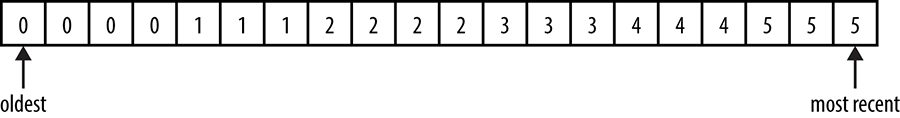

# Practical Alerting from Time-Series Data

> Written by Jamie Wilkinson
> Edited by Kavita Guliani

---

> ### May the queries flow, and the pager stay silent.
>
>  Traditional SRE blessing

Monitoring, the bottom layer of the **Hierarchy of Production Needs**,
is fundamental to running a stable service. Monitoring enables service
owners to make rational decisions about the impact of changes to the
service, apply the scientific method to incident response, and of course
ensure their reason for existence: to measure the service's alignment
with business goals (see [Monitoring Distributed
Systems](https://sre.google/sre-book/monitoring-distributed-systems/)).

Regardless of whether or not a service enjoys SRE support, it should be
run in a symbiotic relationship with its monitoring. But having been
tasked with ultimate responsibility for Google Production, SREs develop
a particularly intimate knowledge of the monitoring infrastructure that
supports their service.

Monitoring a very large system is challenging for a couple of reasons:

* The sheer number of components being analyze
* The need to maintain a reasonably low maintenance burden on the
  engineers responsible for the system

Google's monitoring systems don't just measure simple metric, such as
the average response time of an unladen European web server; we also
need to understand the distribution of those response times across all
web servers in that region. This knowledge enables us to identify the
factors contributing to the latency tail.

At the scale our systems operate, being alerted for single-machine
failures is unacceptable because such data is too noisy to be
actionable. Instead we try to build systems that are robust against
failures in the systems they depend on. Rather than requiring management
of many individual components, a large system should be designed to
aggregate signals and prude outliers. We need monitoring systems that
allow us to alert for high-level service objectives, but retain the
granularity to inspect individual components as needed.

Google's monitoring systems evolved over the course of 10 years from the
traditional model of custom scripts that check responses and alerts,
wholly separated from visual display of trends, to a new paradigm. This
new model made the collection of time-series a first-class role of the
monitoring system,and replaced those check scripts with a rich language
for manipulating time-series into charts and alerts.

## The Rise of Borgmon

Shortly after the job scheduling infrastructure Borg
[[Ver15]](https://sre.google/sre-book/bibliography#Ver15) was created in
2003, a new monitoring system-Borgmon-was build to complement it.

## Time-Series Monitoring Outside of Google

This chapter describes the architecture and programming interface of an
internal monitoring tool that was foundational for the growth and
reliability of Google for almost 10 years...but how does that help you,
our dear reader?

In recent years, monitoring has undergone a Bambrian Explosion: Riemann,
Keka, Bosun, and Prometheus have emerged as open source tools that are
very similar to Borgmon's time-series-based alerting. In particular,
Prometheus[^42] shares many similarities with Borgmon, especially when
you compare the two rule languages. The principles of variable
collection and rule evaluation remain the same across all these tools
and provide an environment with which you can experiment, and hopefully
launch into production, the ideas inspired by this chapter.

Instead of executing custom scripts to detect system failures, Borgmon
relies on a common data exposition format; this enables mass data
collection with low overheads and avoids the costs of subprocess
execution and network connection setup. We call this **white-box
monitoring** (see [Monitoring Distributed
Systems](https://sre.google/sre-book/monitoring-distributed-systems/)
for a comparison of white-box and black-box monitoring).

The data is used both for rendering charts and creating alerts, which
are accomplished using simple arithmetic. Because collection is no
longer in a short-lived process, the history of the collected data can
be used for that alert computation as well.

These features help to meet the goal of simplicity described in
[Monitoring Distributed
Systems](https://sre.google/sre-book/monitoring-distributed-systems/).
They allow the system overhead to be kept low so that the people running
the services can remain agile and respond to continuous change in the
system as it grows.

To facilitate mass collection, the metrics format had to be
standardized. An older method of exporting the internal state (known as
**varz**)[^43] was formalized to allow the collection of all metrics
form a single target in one HTTP fetch. For example, to view a page of
metrics manually, you could use the following command: `% curl
https://webserver:80/varz`

```
http_requests 37
errors_total 12
```

A Borgmon can collection from other Borgmon,[^44] so we can build
hierarchies that follow the topology of the service, aggregating and
summarizing information and discarding some strategically at each level.
Typically, a team runs a single Borgmon per cluster, and a pair at the
global level. Some very large services shard below the cluster level
into many **scraper** Borgmon, which in turn feed to the cluster-level
Borgmon.

## Instrumentation of Applications

The **/varz** HTTP handler simply lists all the exported variables in
plain text, as space-separated keys and values, one per line. A later
extension added a mapped variable, which allows the exporter to define
several labels on variable name, and then export a table of values of a
histogram. An example **map-valued** variable looks like the following,
showing 25 HTTP 200 responses and 12 HTTP 500s:

```
http_responses map:code 200:25 404:0 500:12
```

Adding a metric to a program only requires a single declaration in the
code where the metric is needed.

In hindsight, it's apparent that this schema-less textual interface makes
the barrier to adding new instrumentation very low, which is a positive
for both the software engineering and SRE teams. However, this has a
trade-off against ongoing maintenance; the decoupling of the variable
definition from its use in Borgmon rules requires careful changes
management. In practice, this trade-off has been satisfactory because
tools to validate and generate rules have been written as well.[^45]

### Exporting Variable

Google's web roots run deep: each of the major languages used at Google
has an implementation of the exported variable interface that
automagically registers with the HTTP server built into every Google
binary by default.[^46] The instances of the variable to be exported
allow the server author to perform obvious operation like adding an
amount to the current value, setting a key to a specific value, and so
forth. The Go **expvar** library[^47] and its JSON output form have a
variant of the API.

## Collection of Exported Data

To find its targets, a Borgmon instance is configured with a list of
targets using one of the many name resolution methods.[^48] The target
list is often dynamic, so using service discovery reduces the cost of
maintaining it and allows the monitoring to scale.

At predefined intervals, Borgmon fetches the **/varz** URI on each
target, decodes the results, and stores the values in memory. Borgmon
also spreads the collection from each instance in the target list over
the whole interval, so that collection from each target is not in
lockstep with its peers.

Borgmon also records "synthetic" variables for each target in order to
identify:

* If the name was resolved to a host and port
* If the target responded to a collection
* If the target responded to a health check
* What time the collection finished

These synthetic variables make it easy to write rules to detect if the
monitoring tasks are unavailable.

It's interesting that varz is quite dissimilar to SNMP (Simple Network
Management Protocol), which "is designed [...] to have minimal transport
requirements and to continue working when most other network applications
fail" [[Mic03]](https://sre.google/sre-book/bibliography#Mic03).
Scraping targets over HTTP seems to be at odds with this design
principle; however, experience shows that this is rarely an issue.[^49]
The system itself is already designed to be robust against network and
machine failures, and Borgmon allows engineers to write smarter alerting
rules by using the collection failure itself as a signal.

## Storage in the Time-Series Arena

A service is typically made up of many binaries running as many tasks,
on many machines, in many cluster. Borgmon needs to keep all that data
organized, while allowing flexible querying and slicking of that data.

Borgmon stores all the data in an in-memory database, regularly
checkpointed to disk. The data points have the form `(timestamp,
value)`, and are stored in chronological lists called **time-series**,
and each time-series is named by a unique set of **labels**, of the form
`name=value`.

As presented in **Figure 10-1**, a time-series is conceptually a
one-dimensional matrix of numbers, progressing through time. As you add
permutations of labels to this time-series, the matrix becomes
multidimensional.

 Figure 10-1. A time-series for
errors labeled by the original host each was collected from.

In practice, the structure is a fixed-sized block of memory, known as
the **time-series arena**, with a garbage collector that expires that
oldest entries once the arena is full. The time interval between the
most recent and oldest entries in the arena is the **horizon**, which
indicates how much queryable data is kept in RAM. Typically, datacenter
and global Borgmon are sized to hold about 12 hours of data[^50] for
rendering consoles, and much less time if they are the lowest-level
collector shards. The memory requirement for a single data point is
about 24 bytes, so we can fit 1 million unique time-series for 12 hourse
at 1-minute intervals in under 17 GB of RAM.

Periodically, the in-memory state is archived to an external system
known as the Time-Series Database (TSDB). Borgmon can query TSDB for
older data and, while slower, TSDB is cheaper and larger than a
Borgmon's RAM.

### Labels and Vectors

As shown in the example time-series in **Figure 10-2**, time-series are
stored as a sequences of numbers and timestamps, which are referred to
as **vectors**. Like vectorss in linear algebra, these vectors are
slices and cross-sections of the multidimensional matrix of data points
in the arena. Conceptually the timestamps can be ignored, because the
values are inserted in the vector at regular intervals in time-for
example, 1 or 10 seconds or 1 minute apart.

 Figure 10-2.
An example time-series

Then name of a time-series is a `labelset`, because it's implemented as
a set of labels expressed as `key=value` pairs. One of these labels is
the variable name itself, the key that appears on the verz page.

A few label names are declared as important. For the time-series in the
time-series database to be identifiable, it must at minimum have the
following labels:

* `var`: The name of the variable
* `job`: The name given to the type of server being monitored
* `service`: A loosely defined collection of jobs that provide a service
  to users, either internal or external
* `zone`: A Google convention that refers to the location (typically
  that datacenter) of the Borgmon that performed the collection of this
  variable

Together, these variables appear something like the following, called
the **variable expression**:

```
{var=http_requests,job=webserver,instance=host0:80,service=web,zone=us-west}
```

A query for a time-series does not require specification of all these
labels, and a search for a `labelset` returns all matching time-series
in a vector. So we could return a vector of results by removing the
**instance** label in the preceding query, if there were more than one
instance in the cluster. For example:

```
{var=http_requests,job=webserver,service=web,zone=us-west}
```

Might have a result of five rows in a vector, with the most recent value
in the time-series like so:

```
[var=http_requests,job=webserver,instance=host0:80,service=web,zone=us-west} 10
[var=http_requests,job=webserver,instance=host1:80,service=web,zone=us-west} 9
[var=http_requests,job=webserver,instance=host2:80,service=web,zone=us-west} 11
[var=http_requests,job=webserver,instance=host3:80,service=web,zone=us-west} 0
[var=http_requests,job=webserver,instance=host4:80,service=web,zone=us-west} 10
```

Labels can be added to a time-series from:

* The target's name, e.g., the job and instance
* The target itself, e.g., via map-valued variables
* The Borgmon configuration e.g., annotations about location or
  relabeling
* The Borgmon rules being evaluated

We can also query time-series in time, by specifying a duration to the
variable expression:

```
{var=http_requests,job=webserver,service=web,zone=us-west}[10m]
```

This returns the last 10 minutes of history of the time-series that
matched the expression. If we were collecting data points once per
minute, we would expect to return 10 data points in a 10-minute window,
like so:[^51]

```
{var=http_requests,job=webserver,instance=host0:80, ...} 0 1 2 3 4 5 6 7
8 9 10
{var=http_requests,job=webserver,instance=host1:80, ...} 0 1 2 3 4 4 5 6
7 8 9
{var=http_requests,job=webserver,instance=host2:80, ...} 0 1 2 3 5 6 7 8
9 9 11
{var=http_requests,job=webserver,instance=host3:80, ...} 0 0 0 0 0 0 0 0
0 0 0
{var=http_requests,job=webserver,instance=host4:80, ...} 0 1 2 3 4 5 6 7
8 9 10
```

## Rule Evaluation

Borgmon is really just a programmable calculator, with some syntactic
sugar that enables it to generate alerts. The data collection and
storage components already described are just necessary evils to make
that programmable calculator ultimately fit for purpose here as a
monitoring system. :)

### Note

Centralizing the rule evaluation in a monitoring system, rather than
delegating it to forked subprocesses, means that computations can run in
parallel against many similar targets. This practice keeps the
configuration relatively small in size (for example, by removing
duplication of code) yet more powerful through its expressiveness.

The Borgmon program code, also known as **Borgmon rules**, consists of
simple algebraic expressions that compute time-series from other
time-series. These rules can be quite powerful because they can query
the history of a single time-series (i.e., the time axis), query
different subsets of labels from many time-series at once (i.e., the
space axis), and apply many mathematical operations.

Rules run in parallel thread-pool where possible, but are dependent on
ordering when using previously defined rules as input. The size of the
vectors returned by their query expressions also determines the overall
runtime of a rule. Thus, it is typically the case that one can add CPU
resources to a Borgmon task in response to it running slow. To assists
more detailed analysis, internal metrics on the runtime of rules are
exported for performance debugging and for monitoring the monitoring.

Aggregation is the cornerstone of rule evaluation in a distributed
environment. Aggregation entails taking the sum of a set of time-series
from the tasks on a job in order to treat the job as a whole. From those
sums, overall rates can be computed. For example, the total queries
-per-second rate of a job in a datacenter is the sum of all the rates of
change[^52] of all the query counters.[^53]

### Tip

A counter is any monotonically non-decreasing variable-which is to say,
counters only increase in value. Gauges, on the other hand, may take any
value they like. Counters measure increasing values, such as the total
number of kilometers driven, while gauges show current state, such as
the amount of fuel remaining or current speed. When collection
Borgmon-style data, it's better to use counters, because they don't lose
meaning when events occur between sampling intervals. Should any
activity or changes occur between sampling intervals, a gauge collection
is likely to miss that activity.

For an example web server, we might want to alert when our web server
cluster starts to serve more errors as a percent of requests than we
think is normal-or more technically, when the sum of the rates of
non-HTTP-200 return codes on all tasks in the cluster, divided by the sum
of the rates of requests to all tasks in that cluster, is greater than
some value.

This is accomplished by:

1. Aggregating the rates of response codes across all tasks, outputting
   a vector of rates at that point in time, one for each code.
2. Computing the total error rate as the sum of that vector, outputting
   a single value for the cluster at that point in time. This total
   error rate excludes the 200 code from the sum, because it is not an
   error.
3. Computing the cluster-wide ratio of errors to request, dividing the
   total error rate by the rate of request that arrived, and again
   outputting a single value for the cluster at that point in time.

Each of these outputs at a point in time gets appended to its named
variable expression, which creates the new time-series. As a result, we
will be able to inspect the history of error rates and error rations
some other time.

The rate of requests rules would be written in Borgmon's rule language
as the following rules <<<

```
rules <<<
# Compute the rate of request for each task from the count of requests
{var=task:http_responses:reate10m,job=webserver} = rate by
code({var=http_responses,job=webserver}[10m]);

# Compute a cluster level response rate per 'code' label
{var=dc:http_responses:rate10m,job=webserver} = sum without
instance({var=task:http_responses:rate10m,job=webserver});

# Compute a new cluster level rate summing all non 200 codes
{var=dc:http_erros:rate10m,job=webserver} = sum without code
({var=dc:http_responses:rate10m,job=webserver,code!/200/});

# Compute the ratio of the rate of erros to the rate of request


