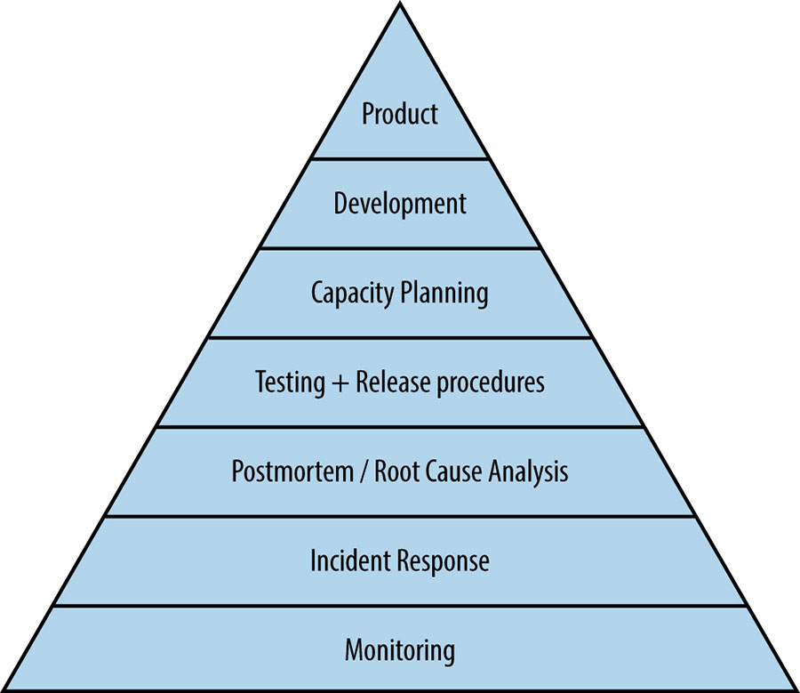

# III - Practices

Put simply, SREs run service-a set of related system, operated for users,
who may be internal or external-and are ultimately responsible for the
health of these services. Successfully operating a service entails a
wide range of activities: developing monitoring systems, planning
capacity, responding to incidents, ensuring the root causes of outages
are addressed, and so on. This section addresses the theory and practice
of an SRE's day-to-day activity: building and operating large
distributed systems.

We can characterize the health of service-in much the same way that
`Abraham Maslow` categorized human needs
[[Mas43]](https://sre.google/sre-book/bibliography#Mas43)-from the most
basic requirements needed for a system to function as a service at all to
the higher levels of function-permitting self-actualization and taking
active control of the direction of the service rather than reactively
fighting fires. This understanding is so fundamental to how we evaluate
services at Google that it wasn't explicitly developed until a number of
Google SREs, including our former colleague Mikey Dickerson,[^41]
temporarily joined the radically different culture of the United States
government to help with the launch of **healthcare.gov** in late 2013
and early 2014: they needed a way to explain how to increase systems'
reliability.

We'll use this hierarchy, illustrated in **Figure 3-1**, to look at the
elements that go into making a service reliable, from most basic to most
advanced.

 Figure
III-1. Service Reliability Hierarchy

### Monitoring

Without monitoring, you have no way to tell whether the service is even
working; absent a thoughtfully designed monitoring infrastructure,
you're flying blind. Maybe everyone who tries to use the website gets
and error, maybe no-but you want to be aware of problems before your
users notice them. We discuss tools and philosophy in [Practical
Alerting from Time-Series
Data](https://sre.google/sre-book/practical-alerting/).

### Incident Response

SREs don't go on-call merely for the sake of it: rather, on-call support
is a tool we use to achieve our larger missions and remain in touch with
how distributed computing systems actually work (and fail!). If we
could find a way to relieve ourselves from carrying a pager, we would.
In [Being On-Call](https://sre.google/sre-book/being-on-call/), we
explain how we balance on-call duties with out other responsibilities.

Once you're aware that there is a problem, how do you make it go away?
That doesn't necessarily mean fixing it once and for all-maybe you can
stop the bleeding by reducing the system's precision or turning off some
features temporarily, allowing it to gracefully degrade, or maybe you
can direct traffic to another instance of the service that's working
properly. The details of the solution you choose to implement are
necessarily specific to your service and your organization. Responding
effectively to incidents, however, is something applicable to all teams.

Figuring out what's wrong is the first step; we offer a structured
approach in [Effective
Troubleshooting](https://sre.google/sre-book/effective-troubleshooting/).

During an incident, it's often tempting to give in to adrenalin and
start responding ad hoc. We advise against this temptation in [Emergency
Response](https://sre.google/sre-book/emergency-response/), and counsel
in [Managing
Incidents](https://sre.google/sre-book/managing-incidents/), that
managing incidents effectively should reduce their impact and limit
outage-induced anxiety.

### Postmortem and Root-Cause Analysis

We aim to be altered on and manually solve only new and exciting
problems presented by our service; it's woefully boring to "fix" the
same issue over and over. In face, this mindset is one of the key
differeniators between SRE philosophy and some more traditional
operations-focused environment. This theme is explored in two chapters.

Building a blameless postmortem culture is the first step in
understanding what went wrong (and what wen right!), as described in
[Postmortem Culture: Learning from
Failure](https://sre.google/sre-book/postmortem-culture/).

Related to that discussion, in [Tracking
Outages](https://sre.google/sre-book/tracking-outages/), we briefly
describe an internal tool, to outage tracker that allows SRE teams to
keep track of recent production incidents, their causes, and actions
taken in response to them.

### Testing

Once we understand what tends to go wrong, our next step is attempting
to prevent it, because an ounce of prevention is worth a pound of cure.
Test suites offer some assurance that our software isn't making certain
classes of errors before it's released to production; we talk about how
best to use these in [Testing for
Reliability](https://sre.google/sre-book/testing-reliability/).

### Capacity Planning

In [Software Engineering in
SRE](https://sre.google/sre-book/software-engineering-in-sre/), we offer
a case study of software engineering in SRE with Auxon, a tool for
automating capacity planning.

Naturally following capacity planning, load balancing ensures we're
properly using the capacity we've built. We discuss how requests to our
services get sent to datacenters in [Load Balancing at the
Frontend](https://sre.google/sre-book/load-balancing-frontend/). Then we
continue the discussion in [Load Balancing in the
Datacenter](https://sre.google/sre-book/load-balancing-datacenter/) and
[Handling Overload](https://sre.google/sre-book/handling-overload/),
both of which are essential for ensuring service reliability.

Finally, in [Addressing Cascading
Failures](https://sre.google/sre-book/addressing-cascading-failures/),
we offer advice for addressing cascading failures, both in system design
and should your service be caught in a cascading failure.

### Development

One of the key aspects of Google's approach to Site Reliability
Engineering is that we do significant large-scale system design and
software engineering work within the organization.

In [Managing Critical State: Distributed Consensus for
Reliability](https://sre.google/sre-book/managing-critical-state/), we
explain distributed consensus, which (in the guise of Paxos) is at the
core of many of Google's distributed systems, including our globally
distributed Cron system. In [Distributed Periodic Scheduling with
Cron](https://sre.google/sre-book/distributed-periodic-scheduling/), we
outline a system that scales to whole datacenters and beyond, which is
no easy task.

 [Data Processing
 Pipelines](https://sre.google/sre-book/data-processing-pipelines/),
 discusses the various forms that data processing pipelines can take:
 form one-shot MapReduce jobs running periodically to systems that
 operate in near real-time. Different architectures can lead to
 surprising and counter intuitive challenges.

Making sure that the data you stored is still there when you want to
read it is the heart of data integrity; in [Data Integrity: What You
Read Is What You Wrote](https://sre.google/sre-book/data-integrity/), we
explain how to keep data safe.

### Product

Finally, having made our way to the reliability pyramid, we find
ourselves at the point of having workable product. In [Reliable Product
Launches at
Scale](https://sre.google/sre-book/reliable-product-launches/), we write
about how Google does reliable product launches at scale to try to give
users the best possible experience starting fro Day Zero.

### Further Reading from Google SRE

As discussed previously, testing is subtle, and its improper execution
can have large effects on overall stability. In an ACM article
[[Kri12]](https://sre.google/sre-book/bibliography#Kri12), we explain
how Google performs **company-wide** resilience testing to ensure we're
capable of weathering the unexpected should a zombie apocalypse or other
disaster strike.

While it's often thought of as a dark art, full of mystifying
spreadsheets divining the future, capacity planning is nonetheless
vital, and as
[[Hix15a]](https://sre.google/sre-book/bibliography#Hix15a) shows, you
don't actually **need** a crystal ball to do it right.

Finally, an interesting and new approach to corporate network security is
detailed in [[War14]](https://sre.google/sre-book/bibliography#War14),
an initiative to replace privileged intranets with device and user
credentials. Driven by SREs at the infrastructure level, this is
definitely an approach to keep in mind when you're creating you next
network.

[^41]: Mikey left Google in summer 2014 to become the first
administrator of the US Digital Service ([https://www.usds.gov/](https://www.usds.gov/)), an agency intended
(in part) to bring SRE principles and practices to the US government's
IT systems.

