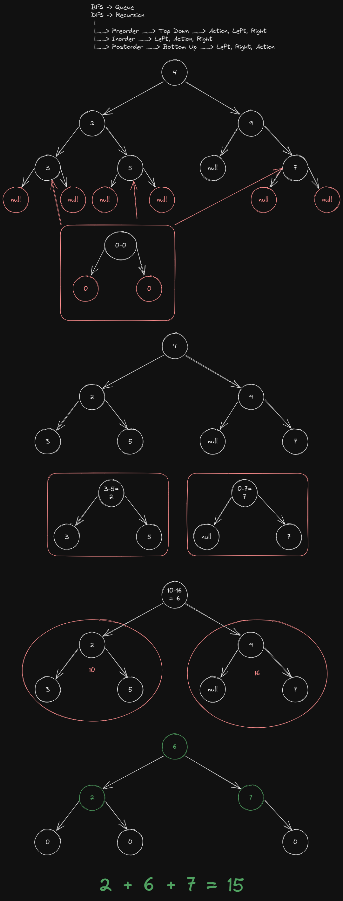

# 563. Binary Tree Tilt

[Leetcode 563](https://leetcode.com/problems/binary-tree-tilt/description/)

Given the `root` of a binary tree, return the sum of every tree node's
**tilt**.

The **tilt** of a tree node is the **absolute difference** between the
sum of all left subtree node **values** and all right subtree node
**values**. If a node does not have a left child then the sum of the left
subtree node **values** is treated as `0`. The rule is similar if the
node does not have a right child.

## Examples:

* Input: root = [1,2,3]
* Output: 1
* Explanation:
  - Tilt of node 2 : |0-0| = 0 (no children)
  - tilt of node 3 : |0-0| = 0 (no children)
  - Tilt of node 1 : |2-3| = 1 (left subtree is just left child, so sum
    is 2; right subtree is just right child, so sum is 3)
  - Sum of every tilt : `0 + 0 + 1 = 1`

### Constraints:

* The number of nodes in the tree is in the range `[0, 10^4]`
* `-1000 <= Node.val <= 1000`

## How should we accomplish this?

Global -> Sum of tilt of whole tree
Local -> each node has to calc its own Tilt

Absolute Value( Sum of left - sum of right)

Global Solution -> Sum of Locals

What info is needed by the node to calculate it's tilt.

* `DFS(Node)`
  - If (node is null): return 0

* Go Left
  - `Left = DFS(node.left)`

* Go Right
  - `Right = DFS(node.right)`

* Action
  - `Local = ABS(left - right)`
  - `Global Tilt = Global Lilt + Local`

* Return node.value + left + right
