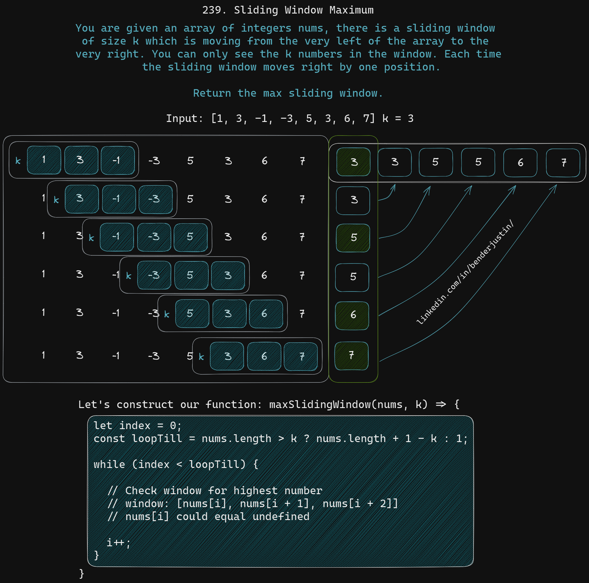
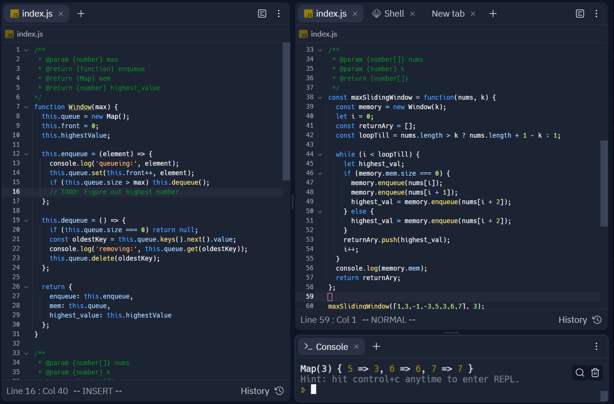
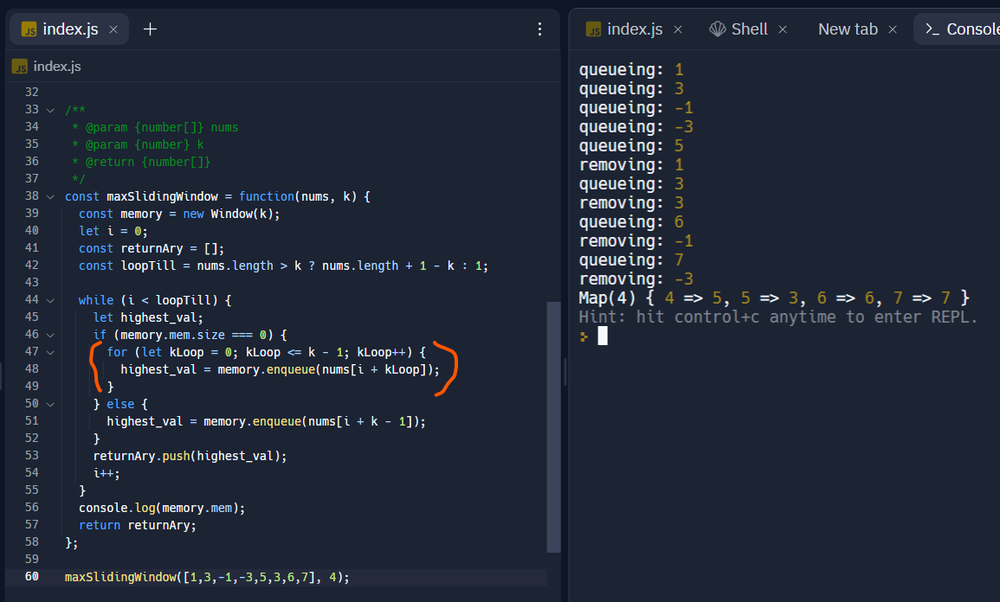

# Sliding Window

> Fri 03/03/2023

## Sliding Window Maximum

> [LeetCode](https://leetcode.com/problems/sliding-window-maximum/description/)

You are given an array of integers `nums`, there is a sliding window of
size `k` which is moving from the very left of the array to the very
right. You can only see the `k` numbers in the windows. Each time the
sliding window moves right by one position.

Return the max sliding window.



### Example 1:

```javascript
Input: nums = [1,3,-1,-3,5,3,6,7], k = 3
Output: [3,3,5,5,6,7]
Explanation:
Window position
---------------
[1  3  -1] -3  5  3  6  7      3
 1 [3  -1  -3] 5  3  6  7      3
 1  3 [-1  -3  5] 3  6  7      5
 1  3  -1 [-3  5  3] 6  7      5
 1  3  -1  -3 [5  3  6] 7      6
 1  3  -1  -3  5 [3  6  7]     7
```

### Example 2:

```
Input: nums = [1], k = 1
Output: [1]
```

### Constraints:

* `1 <= nums.length <= 10^5`
* `-10^4 <= nums[i] <= 10^4`
* `1 <= k <= nums.length`

### Basic Function Shell:

```javascript
/**
 * @param {number[]} nums
 * @param {number} k
 * @return {number[]}
 */
const maxSlidingWindow = function(nums, k) {

};
```




This is how the project would be setup.

### Inputs

* `nums`: Array of number
* `k`: window size

## How can we solve this?

The initial idea is just the sliding window. That is what the example is
doing.

If we break down the first example:

```
Input: nums = [1,3,-1,-3,5,3,6,7], k = 3
```
The input is `nums` and `k`

`k` is telling us how big the window is. `nums` will be an array of
signed numbers.

Inside of each window you find the largest number:

```
[1  3  -1] -3  5  3  6  7      3
```

This first window has `[1, 3, -1]`. The largest number is `3`

```
 1 [3  -1  -3] 5  3  6  7      3
```

This next window brings in a `-3` and drops a `1`. The largest number is
still `3`

```
 1  3 [-1  -3  5] 3  6  7      5
```

With this next loop we bring in a `5` and lose the `3`. This presents a
different response for the max number `5`.

```
 1  3  -1 [-3  5  3] 6  7      5
```

This window brings in a `3` and drops the `-1`. The max is still `5`.

```
 1  3  -1  -3 [5  3  6] 7      6
```

This window brings in a `6` and drops the `-3`. The max changes to `6`.

```
 1  3  -1  -3  5 [3  6  7]     7
```

This window brings in a `7` and drops the `5`. The max changes to `7`.

```
Output: [3,3,5,5,6,7]
```

If we inspect the output we can see that we have `[3,3,5,5,6,7]`
returned. That is the max value in each of this windows. The window size
is `k`

## Possible Solution

We need to loop over the array of numbers in sections of `3` or the
value of `k` that is given.

```javascript
let i = 0;
const loopTill = nums.length - k;
```

We will set the `i` index value to `0`. This value changes. So it stays
a let. We also make a `loopTill` variable that is the length of `nums`
- `k`. This creates the loop parameters to loop and stop at the end of the last window.

```
while (i <= loopTill) {
  // window is nums[i], nums[i + 1], nums[i + 2]
  i++;
}
```

Now that we have the looping window what do we do now?

* Check if the window length is `window.length > nums.length`. We could
  still look inside of the window. We just need to be aware the in
  JavaScript if there is no value. It is likely undefined. Let's check
  that assumption out.

Another note. I'll be adding `1` to the `loopTill` variable so that we
can remove the `=` from the loop. We remove this to avoid 1 extra call
each time to check for `<` and `=`. Now it will just be `<` the 1 check.

```javascript
const loopTill = nums.length + 1 - k;
while (i < loopTill) {
  //...
```

We also have a problem if the `nums` array is shorter than the `k`
value. So if `nums.length >= k ? nums.length + 1 - k : 1;` This will
allow us to run 1 loop. Even if `nums.length + 1 - k` would be `0` of
less. For example, if we have `nums = [1,3]` with `k = 3`. There is a
problem with the math. `2 + 1 - 3 = 0`. Do you notice the problem? There
is a `0` value. This wouldn't allow `while (i < loopTill)` simply
because `i = 0, loopTill = 0, i === loopTill`. So instead of not
looping. We will continue to loop with the expectation that if any of
the values are undefined. That we will just ignore it.

It seems like we have the basic structure of the window we need to loop
over. That's the easy part. Now that it's been broken with with little
optimization in every decision. Let's see where the code is now:

```javascript
/**
 * @param {number[]} nums
 * @param {number} k
 * @return {number[]}
 */
const maxSlidingWindow = function(nums, k) {
  let i = 0;
  const loopTill = nums.length > k ? nums.length + 1 - k : 1;
  while (i < loopTill) {
    // Window access is in nums[i], nums[i + 1], nums[i + 2]
    i++;
  }
};
```

## We can peek now what?

We have the loop over the array in place. But how do we keep track of
the highest value? Do we loop over the window over and over again?

If we loop over everything over and over again. The Big O value will go
up. This means that instead of having an `O(n)` we will have a `O(n *
k)`. Which is a bit more than I would like too shoot for. I'd prefer is
just stick to `O(n)`. How can we remove the need for the extra loops? We
must keep track of it a different way.

What could that different way possibly be? How about some sort of
memory. Some soft of storage that we can check against and create
something more constant.

There will be a give and take here. If the value of `k = 2` and `n =
4`. The amount of iterations would only be around `7` function calls.
This obviously increases at `O(n * k)` like mentioned earlier. If the
numbers become `k = 3, n = 3000`. That seems a little much to do `3000 *
3 = 9000` Well not much for a computer. Let's think about running this
in a serverless function. Something where the cost goes up with the time
spend. `6000` wasteful calls isn't good. It's `2/3` more than it should
be. How can we fix this? How can we make it more constant? What is this
memory that we would like to accomplish. How does it make the search
constant?

Let's use a `hashMap` with a `const mem = new Map();`

What makes the hash map constant. Well the way that the hash map is
created is interesting. Imagine a key value structure that is always in
order. We can check if the value "lives" in a certain area.

What does it mean to "live" in a certain area of the hash map? How does
it stay in order?

Let's talk about this at a very high level. Abstract away to hashing
functions and other smaller features while we focus on the bigger
parts.

Let's think about an array at first `[0,1,2,3,4]` when we use this we
know that it's in order. The index would be the same as the values
entered. `0 index 0`, `1 index 1`. If we change the location of `[1,0]`
then `1 index 0` and `0 index 1`. The index is always in order.

How do we get the numberlike value for the hash map? Well we do exactly
that the object is. We hash it. We can hash any object, array, value,
program. Where it runs a specific function to pull a code. The goal is
to have the code `hash` unique values for everything it produces. If you
change `1` bit. The whole hash is different.

So when the value the `equal` the hash would become the same.

Now let's think about this a little bit more.

If we has my current `.bashrc` file. We get this string.

`B519B4CFFCF125CC536F5E64D1673FDD31439FBCA53B6340F6DD1C921041CEBB`

Now let's `hash` my `.vimrc` file. We get this string.

`C9F308225A3B1CD6C2F94B0CDADDC27C37A1A88C71861E62657577BB79E8E4D5`

Do you see how it can be used now?


`[B519B4CFFCF125CC536F5E64D1673FDD31439FBCA53B6340F6DD1C921041CEBB,
C9F308225A3B1CD6C2F94B0CDADDC27C37A1A88C71861E62657577BB79E8E4D5]` if it
was in order from `[A-Za-z]` and `[0-9]`.

But how do we know where it is again when we look for it?

Well we would have to `re-hash` it every time. But wouldn't that get
expensive? Well, no. That would allow us to reach a constant action.
Even though there are 3 or more internal actions to make hash maps to
work. It will become `O(1)` because it will maintain that constant
state. We could easily use an object for speed. Checking the individual
object location. Let's just think about what we might want to manage in
memory and what we might want to check. We just wanted a little
explanation of what a hash map would be. Compared to an object
structure. That would have to search over keys to find the key that
matches. Although there could be an internal hash map inside of the
object constructor.

Now that we have out data structure picked out. Let's think about how we
might want to use it.

We need to keep track of the highest value. Without having to loop over
each of the values over again.

Let's create a queue data structure using a map:

```javascript
function Queue() {
  const queue = new Map();
  let front = 0;

  function enqueue(element) {
    queue.set(front++, element);
  }

  function dequeue() {
    if (queue.size === 0) return null;
    const first = queue.get(0);
    queue.delete(0);
    front--;
    return first;
  }

  function peek() {
    if (queue.size === 0) return null;
    return queue.get(0);
  }

  function clear() {
    queue.clear();
    front = 0;
  }

  function size() {
    return queue.size;
  }

  function* [Symbol.iterator](https://lite.duckduckgo.com/lite?kd=-1&kp=-1&q=Symbol.iterator) {
    for (let i = 0; i < queue.size; i++) {
      yield queue.get(i);
    }
  }

  return {
    enqueue,
    dequeue,
    peek,
    clear,
    size
    [Symbol.iterator],
  };
}
```

Now let's use out `Queue`:

```javascript
const queue = new Queue();
queue.enqueue("A");
queue.enqueue("B");
queue.enqueue("C");
console.log([...queue]); // ["A", "B", "C"]
// This works because of the [Symbol.iterator]
console.log(queue.peek()); // "A"
console.log(queue.dequeue()); // "A"
console.log(queue.dequeue()); // "B"
console.log(queue.size()); // 1
queue.clear();
console.log(queue.size()); // 0
```

That's is the basic use of the data structure. I think it's missing
something. We want it to have a limit many can fit into the queue. While
also maintaining the highest number in the queue.

How can we add that?

Honestly let's gut it. Make it streamlined into a better structure for our task. We can call it a window. All we need is the enqueue and dequeue at first. We need to add more to this structure now.


```javascript
function Window(max) {
  const queue = new Map(),
    maxQueue = max;
  let front = 0;

  function enqueue(element) {
    if (queue.size === max) dequeue();
    queue.set(front++, element);
  }

  function dequeue() {
    if (queue.size === 0) return null;
    const first = queue.get(0);
    queue.delete(0);
    front--;
    return first;
  }

  return {
    enqueue,
    dequeue,
  };
}
```

I'm going to give an updated version with a lot more here:

```javascript
/**
 * @param {number} max
 * @return {function} enqueue
 * @return {Map} mem
 * @return {number} highest_value
*/
function Window(max) {
  this.queue = new Map();
  this.front = 0;
  this.highestValue;

  this.enqueue = (element) => {
    console.log('queueing:', element);
    this.queue.set(this.front++, element);
    if (this.queue.size > max) this.dequeue();
    // TODO: Figure out highest number.
  };

  this.dequeue = () => {
    if (this.queue.size === 0) return null;
    const oldestKey = this.queue.keys().next().value;
    console.log('removing:', this.queue.get(oldestKey));
    this.queue.delete(oldestKey);
  };

  return {
    enqueue: this.enqueue,
    mem: this.queue,
    highest_value: this.highestValue
  };
}

/**
 * @param {number[]} nums
 * @param {number} k
 * @return {number[]}
 */
const maxSlidingWindow = function(nums, k) {
  const memory = new Window(k);
  let i = 0;
  const returnAry = [];
  const loopTill = nums.length > k ? nums.length + 1 - k : 1;

  while (i < loopTill) {
    let highest_val;
    if (memory.mem.size === 0) {
      memory.enqueue(nums[i]);
      memory.enqueue(nums[i + 1]);
      highest_val = memory.enqueue(nums[i + 2]);
    } else {
      highest_val = memory.enqueue(nums[i + 2]);
    }
    returnAry.push(highest_val);
    i++;
  }
  console.log(memory.mem);
  return returnAry;
};

maxSlidingWindow([1,3,-1,-3,5,3,6,7], 3);
```

This has everything setup so far. The only thing that you would need to do is the figuring out the highest number. So how do we want to do this?

There is a bug that I found. Let's fix it:

```javascript
/**
 * @param {number[]} nums
 * @param {number} k
 * @return {number[]}
 */
const maxSlidingWindow = function(nums, k) {
  const memory = new Window(k);
  let i = 0;
  const returnAry = [];
  const loopTill = nums.length > k ? nums.length + 1 - k : 1;

  while (i < loopTill) {
    let highest_val;
    if (memory.mem.size === 0) {
      for (let kLoop = 0; kLoop <= k - 1; kLoop++) {
        highest_val = memory.enqueue(nums[i + kLoop]);
      }
    } else {
      highest_val = memory.enqueue(nums[i + k - 1]);
    }
    returnAry.push(highest_val);
    i++;
  }
  console.log(memory.mem);
  return returnAry;
};

maxSlidingWindow([1,3,-1,-3,5,3,6,7], 4);
```

If you notice what changed it is:

```javascript
if (memory.mem.size === 0) {
  for (let kLoop = 0; kLoop <= k - 1; kLoop++) {
    highest_val = memory.enqueue(nums[i + kLoop]);
  }
} else {
  highest_val = memory.enqueue(nums[i + k - 1]);
}
```

This allows for the `k` to be dynamic.

We should look deeper into the window section with a graphic before we
create the code. In this next image there is a visual representation of
the values moving through the window. Where we maintain a highest value
and a 2nd highest value. Watching how the values move around with the
colors.

Next we need to add in the index and the value positions.


