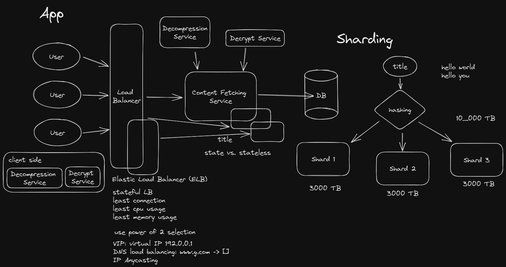

# Given Title of an article (key), return content
10 billion entries. (but what does an entry mean)

What do we think about when this question gets asked?

* Constraints
  - latency
  - availability
* Requirements

## Functional Requirements

1. Write path: dump the 10 billion entries to a db store
  * How do we store it
2. Read path: for a title, return the content

## Non-functional Requirements

* Latency: as soon as possible. 200-250ms
* Availability: as high as possible
* Scalability
  1. storage
  2. user base: QPS
* Durability: persist data

## Content Information

### Storage

* `entries`: 10 billion
* `title`: 100 characters = 100 bytes
* `text content`: 1MB

10_000_000_000 entries * 1MB = 10 PB = 10_000 TB

### Users

* How many people do we have every day: `1_000_000 DAU`
* How many request does 1 person make every day: `10`
* How many request do we receive per day: `10m`
* How many requests do we receive per second: `10_000_000 / 100_000 = 100 QPS`

If we have 1_000_000_000 DAU?
1000 * 100 QPS = 100k QPS

We can handle around 1000 QPS max per servers

---

## What can be cached?

* Static assets
* computationally heavy data
* Read heavy data
* Latency expensive data
* Transient data

Fetch from hard disk HDD: 10ms
Fetch from SSD: 1ms
memory is 10ms / 1000
