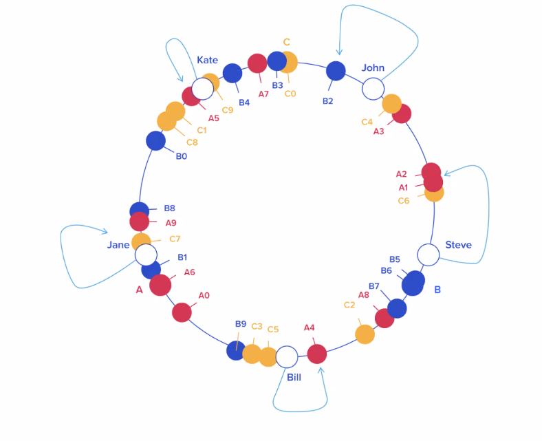
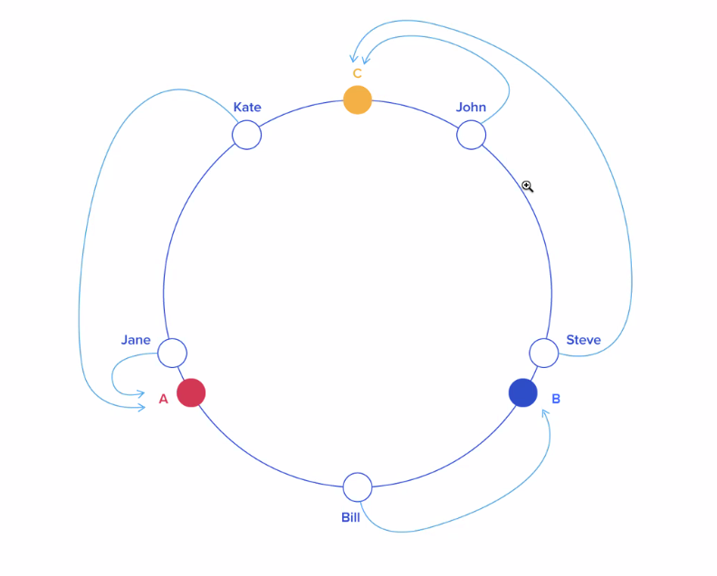

# Distributed Cache

**Work backwards from your customer/user**

### Questions:

* How important is the data is consistent?
* How much data do we need to store?
* How frequently does data need to be retrieved?
* Latency of retrieval
* TTL

We are just providing a service and they can add, update, delete, and
TTL set by customer.

So some of the things above aren't something to worry about. Since the
user can choose what data to stored, how long TTL and how much data
needs to be stored. They just won't matter.

What is the use case? Why are caches used?

To improve latency. Make things happen faster because it doesn't have to
rerun something more expensive.

We could have no update. `New Key` every time.

We want it to be able to horizontally scale.

### API

#### Create Bucket

* `createBucket(name) -> endpoint (https://www.8394894.mycache.com/)`

#### GET

* `get(key, bucket*, credentialKey) -> value`
* `get(key[], bucket*, credentialKey) -> value[]`

#### PUT

* `put(key, bucket, value, ttl, credentialKey) -> bool`
* `put(key[], bucket, value[], ttl, credentialKey) -> bool`

---

### Designing

`Bucket 8394894`
API Gateway -> App server -> X X X X X
                             X X X X X
                             X X X X X
`Bucket`
API Gateway -> App server -> X X X X X
                             X X X X X
                             X X X X X
`Bucket`
API Gateway -> App server -> X X X X X
                             X X X X X
                             X X X X X
`put("john", "2/23")
put("kate", "5/12")
put("jane", "10/15")`

`get("john") -> "2/23"`

How does the app server know that the server in the middle has John?

`App Server`:

`hash("john"+bucket+user) -> 1632928395(fake hash) % 15 -> 2^32 -> 4 billion`

If I add a new server. What happens?

Now I have 16 servers so the `% 15` becomes `% 16`

T0 -> put("john", "2/23") -> Server 1
T1 -> I added a new server
T2 -> get("john") -> "2/23" -> Server 4

We want to imagine that we can't really do this in a reasonable amount
of time. If we do this. We may need to get cache misses to update.

|   Key    |    HASH   |  ANGLE (DEG |
|   :-:    |   :---:   |   :----:    |
| "john"   |  8757892  |   23.5      |
| "bill"   |  8797823  |   234       |

Must store the servers in memory.

"A"  38972398 200.6
"B"  87987293 290.8
"C"  22839304 81.7

This won't really scale out horizontally that well. But it might get us
to fairly large scale.

**This won't be truly unlimited.**

We still have to think about when we add a new server. What happens?

We could allow them to have misses once in a while. But charge less.

What can we do to fix this though?

Go back clockwise. Get all the keys from there and delete all the values
and replace them to the newly added storage within the ring. You don't
redistribute the whole thing. You just redistribute some.

### What if on of the hosts went bad and `C` is offline

All of the values from `B` to `C` would no longer be cached.

We are taking advantage of DNS if we use a custom endpoint for every
customer.
