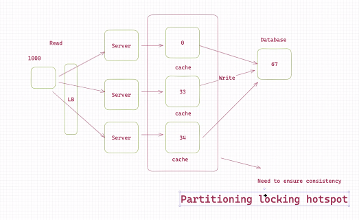

# A hotel booking application

## Functional Requirements

### User

*  Book hotel room for a certain date.
*  Search for hotels by location
*  Able to filter by price and other features.
* Should be able to cancel booking w/in a certain window.

### Admin

* Store a user and dates and hotel?
* The prices should be updated daily

> Do not spend more than a few minutes on the requirements in a real
interview.

## Non-Functional Requirements

* Don't overbook
* Under booking? 100 rooms ---> 2 rooms ---> For a short period of time, no more rooms is available

## Info on bookings

* 5m hotel rooms
* 50m booking a week

## Data Model

* User
* Hotel
* Rooms
* Booking

Flow of reservation

1. Search
2. Results
3. View and compare the results
4. Reserve the room inventory
5. Payment
6. Confirm the booking

**Need a session transaction! (All or none)** SQL Database ACID

## APIs

1. Search
2. GetHotelDetail (hotelID)
3. CompareHotels ([roomId's])
4. GetAvailableRooms (hotelId, startDate, endDate)
5. Book

## How do we implement the system?

[client] --> [Server] --> [ACID DB] Room Inventory
                \
                 -----> [       ] Booking

### Distributed transactions:

1. 2PC, 3PC
2. SAGA
3. Message Queues

RDBS

Scaling:

- Sharding (GeoSharding e.g.)

Hotspots or hot season or hot hotels

A hotel in NY during XMAS: 100 rooms

[ ] --- 1000 --> [ cache] -- write -> [database]

Reject 900
Accept 100

Write: updates both cache and database
Read: only reads from cache

This way we protected the database for all READ requests (1000 read
requests, 900 of them should be rejected, those are the ones that are
read from the cache).

