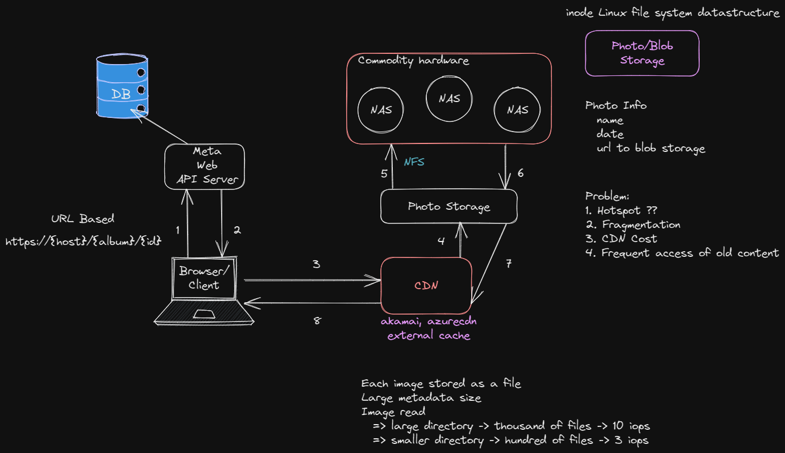

# Design a Photo Server (FB)

### Requirements

* Upload
* View
* Edit
* Delete

1. 260 Billion images = 20 PB data
2. User upload one billion new photos (60TB) each week
3. Serve 1 million images/sec

### BLOB (Binary Large Objects)

#### Access Pattern

1. Write once
2. Read often
3. Rarely modified

### Non-functional Requirements

1. Consistency? Eventual? Strong...
2. High throughput and low latency
3. High available
4. Fault Tolerance - redundancy they keep 3 copies per photo

