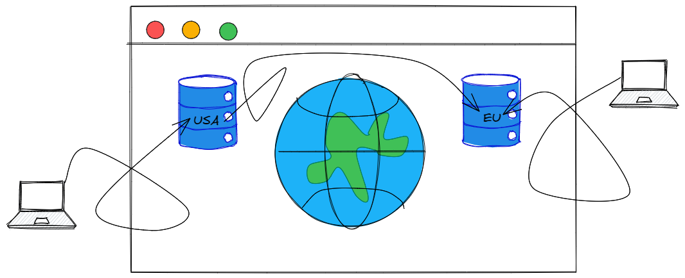
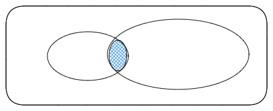
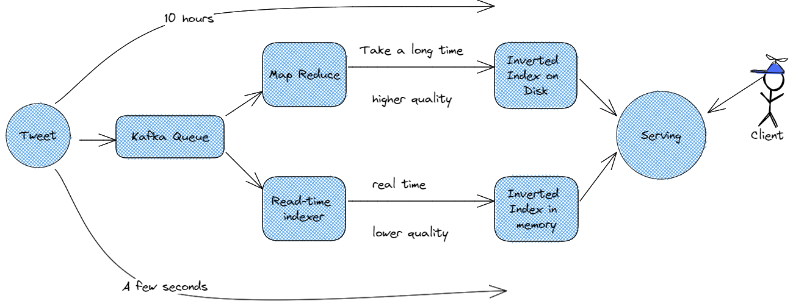

# Design a Tweet Search service for Twitter

How can we do this and what are the functional requirements?


## Functional Requirements

* As a user I should be able to post a tweet
* As a user I should be able to search a tweet in real time

## Non-functional Requirements

* Scalable: `1B DAU`
* Low latency: `< 200ms`
* Consistency: `CAP heorem. If there is a Write, the next READ should capture that.`

#### Types of consistency

* `Strong`: If there is a *WRITE*, the next immediate *READ* after that will see the data.
* `Eventual`: If there is a *WRITE*, the next *READ* may not see that, but
  eventually after `k` *READS*, we will see the data in that *WRITE*.
* `Weak`



#### Why Eventual Consistency?

Weakening consistency might improve availability of your system and also
might simplify the design.

Example: If there is a *WRITE*, and all *READ's* after 10 seconds will have
access to that data.

> For financial transactions, eventual consistency may not be acceptable
or it should be handled with much more care.

For tweets, however, eventual consistency is more acceptable as long as
it is reasonable. In this case, we aim for a few hundred ms.

### Designing the API

* Posting
  - `PostTweet(string message, int uid)`
* View a tweet:
  - `GetTweet(tweetId)`
* Search:
  - `Search(string phrase)`, returns a list of tweets

### How do we search? What is our data model?

What is our data model? How do we store tweets?

* `Tweet`
* `id`
* `uid`
* `message`
* `imageUrl`

* NoSQL, key value?
  - A lot of write, also a lot of read.

* Index based on Tweet is and user id.

* Based on the message?

```
Inverted Index?

String: [D1, D2, ...]

Example:

THE: [D1, D2, D3, D4, D5, D6, ...]
FOOD: [D1, D2, D3, D4, ...]
DOG: [D10, D11, ...]

DOG -> D10, D11
DOG FOOD -> Union? Intersection? Intersection followed by Union-intersection?
```



1. How long does it take to build inverted index?
2. How long does it take to perform intersection and union?

Lambda Architecture

* `Batch`: detailed analysis of data in batches, and it can be slow. e.g.,
  map reduce
* `Speed`: processing data in real time and provide results quickly:
  Storm, Flink
* `Serving`: combining the results from both paths, and serve it to the
  user.


### Kafka Queue Model




Inverted index
Intersections

* `Intersection of list1 and list2`. What if their sizes are huge?
* `Approach1`: put them in a set
* `Approach2`: Sort the lists, then merge them: mergesort, bucket sort

* `External sort`: your entire collection does not fit in memory, so we put
it on external storage. We bring a subset of the data in the internal
memory to sort and then write the result on disk

#### Sharding

`Document based`:

* *Read*: O(Shard)
* *Write*: O(1)

```
         |     |    |    |         |
THE: [D1,| D2, | D3,| D4,| D5, D6, |...]
FOOD:[D1,| D2, | D3,| D4,| ...     |D100]
DOG: [D1,|     | D3,| ...|]        |D100]
         |     |    |    |         |
```

`Term based`:

* *Read*: you don't read from all shards. O(Terms)
* *Write*: O(Terms)

```
THE: [D1, D2, D3, D4, D5, D6, ...]
----------------------------------
FOOD:[D1, D2, D3, D4, ...]
----------------------------------
DOG: [D1,     D3, ...]
```

What are some problems with the lambda architecture?

* lower quality for real time queries
* Maintenance of two paths is not easy
