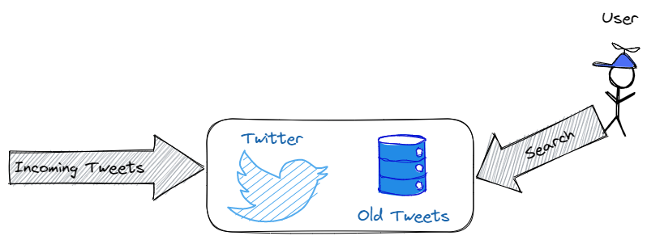

# Design a Tweet Search service for Twitter

How can we do this and what are the functional requirements?

## Functional Requirements

* As a user I should be able to post a tweet
* As a user I should be able to search a tweet in real time

## Non-functional Requirements

* Scalable: `1B DAU`
* Low latency: `< 200ms`
* Consistency: `CAP heorem. If there is a Write, the next READ should capture that.`

#### Types of consistency

* `Strong`: If there is a *WRITE*, the next immediate *READ* after that will see the data.
* `Eventual`: If there is a *WRITE*, the next *READ* may not see that, but
  eventually after `k` *READS*, we will see the data in that *WRITE*.
* `Weak`

#### Why Eventual Consistency?

Weakening consistency might improve availability of your system and also
might simplify the design.

Example: If there is a *WRITE*, and all *READ's* after 10 seconds will have
access to that data.

> For financial transactions, eventual consistency may not be acceptable
or it should be handled with much more care.

For tweets, however, eventual consistency is more acceptable as long as
it is reasonable. In this case, we aim for a few hundred ms.

### Designing the API

* Posting
  - `PostTweet(string message, int uid)`
* View a tweet:
  - `GetTweet(tweetId)`
* Search:
  - `Search(string phrase)`, returns a list of tweets

